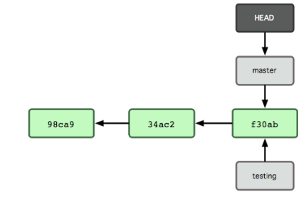

#Git版本控制的学习
#第一章
##1.1介绍

版本控制是一种记录若干文件内容变化，以便将来查阅特定版本修订情况的系统。我们可以对保存着软件源代码的文本文件作版本控制管理，也可以对任何类型的文件进行版本控制。

&nbsp;&nbsp;&nbsp;&nbsp;&nbsp;&nbsp;Git是一个开源的分布式版本控制系统，用以有效、高速的处理从很小到非常大的项目版本管理。Git 是 Linus Torvalds 为了帮助管理 Linux 内核开发而开发的一个开放源码的版本控制软件。

&nbsp;&nbsp;&nbsp;&nbsp;&nbsp;&nbsp;客户端并不只提取最新版本的文件快照，而是把原始的代码仓库完整地镜像下来。这么一来，任何一处协同工作用的服务器发生故障，事后都可以用任何一个镜像出来的本地仓库恢复。因为每一次的提取操作，实际上都是一次对代码仓库的完整备份。

&nbsp;&nbsp;&nbsp;&nbsp;&nbsp;&nbsp;更进一步，许多这类系统都可以指定和若干不同的远端代码仓库进行交互。籍此，你就可以在同一个项目中，分别和不同工作小组的人相互协作。你可以根据需要设定不同的协作流程，比方说层次模型式的工作流，这在以前的集中式系统中是无法实现的。

##1.2Git 和其他版本控制系统的主要差别

###1.直接快照，而非比较差异
- 
Git 和其他版本控制系统的主要差别在于，Git 只关心文件数据的整体是否发生变化，而大多数其他系统则只关心文件内容的具体差异。这类系统（CVS，Subversion,Perforce，Bazaar 等等）每次记录有哪些文件作了更新，以及都更新了哪些行的什么内容

- 
Git 并不保存这些前后变化的差异数据。实际上，Git 更像是把变化的文件作快照后，记录在一个微型的文件系统中。每次提交更新时，它会纵览一遍所有文件的指纹信息并对文件作一快照，然后保存一个指向这次快照的索引。为提高性能，若文件没有变化，Git 不会再次保存，而只对上次保存的快照作一连接。

###2.所有的操作都可以本地执行
- 
Git 在本地磁盘上就保存着所有有关当前项目的历史更新,绝大多数操作都只需要访问本地文件和资源，不用连网，处理速度快。另外我们不管在任何地方都可以轻松的进行管理。

###3.时刻保持数据完整性
- 在保存到 Git 之前，所有数据都要进行内容的校验和（checksum）计算，并将此结果作为数据的唯一标识和索引。

- 
Git 使用 SHA-1 算法计算数据的校验和，通过对文件的内容或目录的结构计算出一个 SHA-1 哈希值，作为指纹字符串。该字串由 40 个十六进制字符（0-9 及 a-f）组成，看起来就像是：

<pre><code style="color: #000000;">24b9da6552252987aa493b52f8696cd6d3b00373
</pre></code>
###4.多数操作仅添加数据

- 
常用的 Git 操作大多仅仅是把数据添加到数据库。因为任何一种不可逆的操作，比如删除数据，要回退或重现都会非常困难。

###5.三种状态

- 
1. 在工作目录中修改某些文件。

- 
2. 对这些修改了的文件作快照，并保存到暂存区域。

- 
3. 提交更新，将保存在暂存区域的文件快照转储到 git 目录中。

##1.3安装Git

安装方式大致可分为两种：一种是通过源码编译安装，另一种是使用特定平台编译好的安装包,这里我是使用系统编译好的安装包进行安装，这种方式不需要自己安装一些依赖库：

- 在centos/redhat/Fedora系列上安装：
<pre><code class="shell" style="color: #000000;">yum install git-core -y
</pre></code>

- 在ubuntu/debian上安装：
<pre><code class="shell" style="color: #000000;">sudo apt-get install git-core -y
</pre></code>

- 在 Mac 上安装:
<pre><code class="shell" style="color: #000000;">sudo port install git-core +svn +doc +bash_completion +gitweb
</pre></code>

- 在 Windows 上安装：可以在下载windows版的[github](https://desktop.github.com/),然后安装。
##1.4初次运行 Git 前的配置

&nbsp;&nbsp;&nbsp;&nbsp;&nbsp;&nbsp;一般在新的系统上，我们都需要先配置下自己的 Git 工作环境。配置工作只需一次，以后升级时还会沿用现在的配置。当然，如果需要，你随时可以用相同的命令修改已有的配置。

Git 提供了一个叫做 git config 的工具，专门用来配置或读取相应的工作环境变量。而正是由这些环境变量，决定了 Git 在各个环节的具体工作方式和行为。这些变量可以存放在以下三个不同的地方：

- 
1./etc/gitconfig文件：系统中对所有用户都普遍适用的配置。若使用 git config 时用 --system 选项，读写的就是这个文件。

- 
2.~/.gitconfig文件：用户目录下的配置文件只适用于该用户。若使用 git config 时用 --global 选项，读写的就是这个文件。

- 
3.当前项目的 git 目录中的配置文件（也就是工作目录中的 .git/config 文件）：这里的配置仅仅针对当前项目有效。每一个级别的配置都会覆盖上层的相同配置，所以 .git/config 里的配置会覆盖 /etc/gitconfig中的同名变量。

在 Windows 系统上，Git 会找寻用户主目录下的 .gitconfig 文件。主目录即 $HOME 变量指定的目录，一般都是 C:\Documents and Settings\$USER。此外，Git 还会尝试找寻 /etc/gitconfig 文件，只不过看当初 Git 装在什么目录，就以此作为根目录来定位。

###1.4.1用户信息

- 
第一个要配置的是你个人的用户名称和电子邮件地址。这两条配置很重要，每次 Git 提交时都会引用这两条信息，说明是谁提交了更新，所以会随更新内容一起被永久纳入历史记录：

<pre><code class="shell" style="color: #000000;">docker@py:~$ git config --global user.name "hyserver"
docker@py:~$ git config --global user.email 1020659371@qq.com
docker@py:~$ cat .gitconfig 
[user]
	name = hyserver
	email = 1020659371@qq.com
</code></pre>
- 
设置的是默认使用的文本编辑器（Linux上默认一般是vim或vi）。Git 需要你输入一些额外消息的时候，会自动调用一个外部文本编辑器给你用。如果你有其他偏好，比如 Emacs 的话，可以重新设置：

<pre><code class="shell" style="color: #000000;"> git config --global core.editor emacs
</code></pre>
- 差异分析工具：

&nbsp;&nbsp;&nbsp;&nbsp;&nbsp;&nbsp;还有一个比较常用的是，在解决合并冲突时使用哪种差异分析工具。比如要改用 vimdiff 的话：

<pre><code class="shell" style="color: #000000;"> git config --global merge.tool vimdiff
</code></pre>

&nbsp;&nbsp;&nbsp;&nbsp;&nbsp;&nbsp;Git 可以理解 kdiff3，tkdiff，meld，xxdiff，emerge，vimdiff，gvimdiff，ecmerge，和 opendiff 等合并工具的输出信息。

- 查看配置信息：

&nbsp;&nbsp;&nbsp;&nbsp;&nbsp;&nbsp;要检查已有的配置信息，可以使用 git config --list 命令：

<pre><code class="shell" style="color: #000000;">docker@py:~$ git config --list
user.name=hyserver
user.email=1020659371@qq.com
</code></pre>

&nbsp;&nbsp;&nbsp;&nbsp;&nbsp;&nbsp;有时候会看到重复的变量名，那就说明它们来自不同的配置文件（比如 /etc/gitconfig 和 ~/.gitconfig），不过最终 Git 实际采用的是最后一个。

&nbsp;&nbsp;&nbsp;&nbsp;&nbsp;&nbsp;也可以直接查阅某个环境变量的设定，只要把特定的名字跟在后面即可，像这样：

<pre><code class="shell" style="color: #000000;">docker@py:~$ git config user.name
hyserver hy
</code></pre>

##1.5获取帮助

可以通过下面三种方式：

- a.获取所有命令(git help <verb>)：
<pre><code class="shell" style="color: #000000;">docker@py:~$ git help
usage: git [--version] [--help] [-C <path>] [-c name=value]
           [--exec-path[=<path>]] [--html-path] [--man-path] [--info-path]
           [-p|--paginate|--no-pager] [--no-replace-objects] [--bare]
           [--git-dir=<path>] [--work-tree=<path>] [--namespace=<name>]
           <command> [<args>]
The most commonly used git commands are:
   add        Add file contents to the index
   bisect     Find by binary search the change that introduced a bug
   branch     List, create, or delete branches
   checkout   Checkout a branch or paths to the working tree
   clone      Clone a repository into a new directory
   commit     Record changes to the repository
   diff       Show changes between commits, commit and working tree, etc
   fetch      Download objects and refs from another repository
   grep       Print lines matching a pattern
   init       Create an empty Git repository or reinitialize an existing one
   log        Show commit logs
......
</code></pre>
- b.使用（git <verb> --help）
<pre><code class="shell" style="color: #000000;">docker@py:~$ git --help
usage: git [--version] [--help] [-C <path>] [-c name=value]
           [--exec-path[=<path>]] [--html-path] [--man-path] [--info-path]
           [-p|--paginate|--no-pager] [--no-replace-objects] [--bare]
           [--git-dir=<path>] [--work-tree=<path>] [--namespace=<name>]
           <command> [<args>]
The most commonly used git commands are:
   add        Add file contents to the index
   bisect     Find by binary search the change that introduced a bug
   branch     List, create, or delete branches
   checkout   Checkout a branch or paths to the working tree
   clone      Clone a repository into a new directory
......
</code></pre>
- c.使用man获取命令帮助：
<pre><code class="shell" style="color: #000000;">docker@py:~$ man git
GIT(1)                               Git Manual                               GIT(1)
NAME
       git - the stupid content tracker
SYNOPSIS
       git [--version] [--help] [-C <path>] [-c <name>=<value>]
           [--exec-path[=<path>]] [--html-path] [--man-path] [--info-path]
           [-p|--paginate|--no-pager] [--no-replace-objects] [--bare]
           [--git-dir=<path>] [--work-tree=<path>] [--namespace=<name>]
           <command> [<args>]
DESCRIPTION
       Git is a fast, scalable, distributed revision control system with an
       unusually rich command set that provides both high-level operations and full
       access to internals.
       See gittutorial(7) to get started, then see Everyday Git[1] for a useful
       minimum set of commands. The Git User’s Manual[2] has a more in-depth
       introduction.
......
</code></pre>

- 获取单个命令的用法：
<pre><code class="shell" style="color: #000000;">docker@py:~$ git help pull
GIT-PULL(1)                          Git Manual                          GIT-PULL(1)
NAME
       git-pull - Fetch from and integrate with another repository or a local branch
SYNOPSIS
       git pull [options] [<repository> [<refspec>...]]
DESCRIPTION
       Incorporates changes from a remote repository into the current branch. In its
       default mode, git pull is shorthand for git fetch followed by git merge
       FETCH_HEAD.
       More precisely, git pull runs git fetch with the given parameters and calls
       git merge to merge the retrieved branch heads into the current branch. With
       --rebase, it runs git rebase instead of git merge.
       <repository> should be the name of a remote repository as passed to git-
       fetch(1). <refspec> can name an arbitrary remote ref (for example, the name
       of a tag) or even a collection of refs with corresponding remote-tracking
       branches (e.g., refs/heads/*:refs/remotes/origin/*), but usually it is the
       name of a branch in the remote repository.
</code></pre>
#第二章

通过上一章的学习，简单的了解了一下Git，接下来配置一下本地git与github如何关联及相关使用

##2.1Github上ssh key的配置
- 在Linux上生成ssh key：
<pre><code class="shell" style="color: #000000;">docker@py:~$ ssh-keygen -t rsa -b 2048
docker@py:~$ cd .ssh/
docker@py:~/.ssh$ cat id_rsa.pub 
ssh-rsa AAAAB3NzaC1yc2EAAAADAQABAAABAQDZsWksokdP/luosG0mAbxGnR4QvFOjC93knshmNGtPhIm2yPfazoq/yfnA3DmmOEt6CETvr+LMhz20VuZ1RTVRge3rGCRScqa5n9UDFAMOq7ePTgu7jApyamLtScPOMvxSVljI0IJAy07t/mKQJU4whtj/UrvuECDpn1bHIkJaFfndp4exx6O2IsmGBGF9eszqxNPG0njhLZCkvCJ41PXJJ1pAS5NQ0gYYALJkw/87koIH927V1TI1ahQlvyUJ4aXRFjPE09bz2oK8fY8H7AToWAXrkZLylicq3fM9iXamT2/p3Yl8L+tsFcaGsx+elc8YvcdXBVFJ0pLYZYTHwwVD docker@py
</code></pre>

登陆github网站，点击Settings——SSH keys——点击右侧的Add SSH key ，随便起一个名字，然后将上面的公钥粘贴--确定--新创建一个Repository（例如hello）后面会用到，然后再做后续操作。

##2.2取得项目的 Git 仓库

&nbsp;&nbsp;&nbsp;&nbsp;&nbsp;&nbsp;有两种取得 Git 项目仓库的方法。第一种是在现存的目录下，通过导入所有文件来创建新的 Git 仓库。第二种是从已有的 Git 仓库克隆出一个新的镜像仓库来。

- 从当前目录初始化
<pre><code class="shell" style="color: #000000;">docker@py:~$docker@py:~$ mkdir hyserver
docker@py:~$ cd hyserver/
docker@py:~/hyserver$ git init  #为新创建的目录初始化
Initialized empty Git repository in /home/docker/hyserver/.git/
</code></pre>

&nbsp;&nbsp;&nbsp;&nbsp;&nbsp;&nbsp;初始化后，在当前目录下会出现一个名为 .git 的目录，所有 Git 需要的数据和资源都存放在这个目录中。不过目前，仅仅是按照既有的结构框架初始化好了里边所有的文件和目录，但我们还没有开始跟踪管理项目中的任何一个文件。（在第九章我们会详细说明刚才创建的 .git 目录中究竟有哪些文件，以及都起些什么作用。）如果当前目录下有几个文件想要纳入版本控制，需要先用 git add 命令告诉 Git 开始对这些文件进行跟踪，然后提交：

<pre><code class="shell" style="color: #000000;">docker@py:~/hyserver$ ls
hello.py  README.md  tab.py
docker@py:~/hyserver$ git add README.md   #添加代码，这里添加目录也是一样，但是目录非空
docker@py:~/hyserver$ git add *.py
docker@py:~/hyserver$ git commit -m "test"	#提交代码
[master (root-commit) f3c51de] test
 3 files changed, 27 insertions(+)
 create mode 100644 README.md
 create mode 100644 hello.py
 create mode 100644 tab.py
然后我们将本地的文件传送至github中，使用如下命令：
docker@py:~/hyserver$ git remote add origin https://github.com/hyserver/hyserver.git  #这个路径是之前新创建的
docker@py:~/hyserver$ git push -u origin master
Username for 'https://github.com': hyserver
Password for 'https://hyserver@github.com': 
Counting objects: 5, done.
Compressing objects: 100% (5/5), done.
Writing objects: 100% (5/5), 650 bytes | 0 bytes/s, done.
Total 5 (delta 0), reused 0 (delta 0)
To https://github.com/hyserver/hyserver.git
 * [new branch]      master -> master
Branch master set up to track remote branch master from origin.
</code></pre>

##2.3从现有仓库克隆

如果想对某个开源项目出一份力，可以先把该项目的 Git 仓库复制一份出来，这就需要用到 git clone 命令。Git 收取的是项目历史的所有数据（每一个文件的每一个版本），服务器上有的数据克
隆之后本地也都有了。实际上，即便服务器的磁盘发生故障，用任何一个克隆出来的客户端都可以重建服务器上的仓库，回到当初克隆时的状态。

这里我们需要复制代码的连接，然后克隆：

<pre><code class="shell" style="color: #000000;">git clone https://github.com/hyserver/hyserver.git
</pre></code>

这会在当前目录下创建一个名为 “hyserver” 的目录，其中内含一个 .git 的目录，并从同步后的仓库中拉出所有的数据，取出最新版本的文件拷贝。如果进入这个新建的hyserver目录，你会看到项目中的所有文件已经在里边了，准备好后续的开发和使用。如果希望在克隆的时候，自己定义要新建的项目目录名称，可以在上面的命令最后指定：

<pre><code class="shell" style="color: #000000;">git clone https://github.com/hyserver/hyserver.git mycode
</pre></code>

唯一的差别就是，现在新建的目录成了 mygrit，其他的都和上边的一样。

##2.4记录每次更新到仓库

现在我们手上已经有了一个真实项目的 Git 仓库，并从这个仓库中取出了所有文件的工作拷贝。接下来，对这些文件作些修改，在完成了一个阶段的目标之后，提交本次更新到仓库。

工作目录下面的所有文件都不外乎这两种状态：已跟踪或未跟踪。已跟踪的文件是指本来就被纳入
版本控制管理的文件，在上次快照中有它们的记录，工作一段时间后，它们的状态可能是未更新，已修改或者已放入暂存区。而所有其他文件都属于未跟踪文件。它们既没有上次更新时的快照，也不在当前的暂存区域。初次克隆某个仓库时，工作目录中的所有文件都属于已跟踪文件，且状态为未修改。

在编辑过某些文件之后，Git 将这些文件标为已修改。我们逐步把这些修改过的文件放到暂存区域，然后等最后一次性提交暂存区域的所有文件更新，如此重复。

###2.4.1检查当前文件状态

要确定哪些文件当前处于什么状态，可以用 git status 命令。如果在克隆仓库之后立即执行此命令，会看到类似这样的输出：

<pre><code class="shell" style="color: #000000;">docker@py:~/hyserver$ git status
On branch master
Your branch is up-to-date with 'origin/master'.
nothing to commit, working directory clean
</pre></code>

这说明你现在的工作目录相当干净。当前没有任何跟踪着的文件，也没有任何文件在上次提交后
更改过。此外，上面的信息还表明，当前目录下没有出现任何处于未跟踪的新文件，否则 Git 会在这里列出来。最后，该命令还显示了当前所在的分支是 master，这是默认的分支名称，实际是可以修改的，现在不必多虑。下一章我们就会详细讨论分支和引用。

###2.4.2跟踪新文件
<pre><code class="shell" style="color: #000000;">docker@py:~/hyserver$ touch file.py
docker@py:~/hyserver$ git add file.py 
docker@py:~/hyserver$ git status 
On branch master
Your branch is up-to-date with 'origin/master'.

Changes to be committed:
  (use "git reset HEAD <file>..." to unstage)

	new file:   file.py

</pre></code>
###2.4.3暂存已修改文件
<pre><code class="shell" style="color: #000000;">docker@py:~/hyserver$ git add README.md 
docker@py:~/hyserver$ git status 
On branch master
Your branch is up-to-date with 'origin/master'.

Changes to be committed:
  (use "git reset HEAD <file>..." to unstage)

	modified:   README.md

</pre></code>
###2.4.4忽略某些文件

一般我们总会有些文件无需纳入 Git 的管理，也不希望它们总出现在未跟踪文件列表。通常都是些自动生成的文件，像是日志或者编译过程中创建的等等。我们可以在某一个项目所在目录创建一个名为 .gitignore 的文件，列出要忽略的文件模式，来看一个简单的例子：

<pre><code class="shell" style="color: #000000;">docker@py:~/hyserver$ cat .gitignore 
*.[co]
*~
docker@py:~/hyserver$ touch 12.c
docker@py:~/hyserver$ touch 11.o
docker@py:~/hyserver$ ls
11.o  12.c  file.py  hello.py  README.md  tab.py
docker@py:~/hyserver$ git add *
The following paths are ignored by one of your .gitignore files:
11.o
12.c
Use -f if you really want to add them.
fatal: no files added	#我们可以看到11.o和12.c并没有文件被添加

</pre></code>
####文件 .gitignore 的格式规范如下：
- 所有空行或者以注释符号 ＃ 开头的行都会被 Git 忽略。
- 可以使用标准的 glob 模式匹配。
- 匹配模式最后跟反斜杠（ /）说明要忽略的是目录。
- 要忽略指定模式以外的文件或目录，可以在模式前加上惊叹号（ !）取反。

所谓的 glob 模式是指 shell 所使用的简化了的正则表达式。星号（ *）匹配零个或多个任意字符； [abc] 匹配任何一个列在方括号中的字符（这个例子要么匹配一个 a，要么匹配一个 b，要么匹配一个 c）；问号（?）只匹配一个任意字符；如果在方括号中使用短划线分隔两个字符，表示所有在这两个字符范围内的都可以匹配（比如 [0-9] 表示匹配所有 0 到 9 的数字）。

####我们再看一个 .gitignore 文件的例子：
<pre><code class="shell" style="color: #000000;"># 此为注释 – 将被 Git 忽略
*.a # 忽略所有 .a 结尾的文件
!lib.a # 但 lib.a 除外
/TODO # 仅仅忽略项目根目录下的 TODO 文件，不包括 subdir/TODO
build/ # 忽略 build/ 目录下的所有文件
doc/*.txt # 会忽略 doc/notes.txt 但不包括 doc/server/arch.txt
</pre></code>
###2.4.5查看已暂存和未暂存的更新

&nbsp;&nbsp;&nbsp;&nbsp;&nbsp;&nbsp;实际上 git status 的显示比较简单，仅仅是列出了修改过的文件，如果要查看具体修改了什么地方，可以用git diff 命令。稍后我们会详细介绍 git diff，不过现在，它已经能回答我们的两个问题了：当前作的哪些更新还没有暂存？有哪些更新已经暂存起来准备好了下次提交？ git diff 会使用文件补丁的格式显示具体添加和删除的行。

假如再次修改 README 文件后暂存，然后编辑 benchmarks.rb 文件后先别暂存，运行 status 命令，会看到：
<pre><code class="shell" style="color: #000000;">docker@py:~/hyserver$ git status 
On branch master
Your branch is up-to-date with 'origin/master'.
Changes to be committed:
  (use "git reset HEAD <file>..." to unstage)
	modified:   README.md
Changes not staged for commit:
  (use "git add [file]>..." to update what will be committed)
  (use "git checkout -- [file]..." to discard changes in working directory)

	modified:   "git\345\255\246\344\271\240.md"
	modified:   hello.py
Untracked files:
  (use "git add <file>..." to include in what will be committed)
	.gitignore
</pre></code>

要查看尚未暂存的文件更新了哪些部分，不加参数直接输入 git diff：

<pre><code class="shell" style="color: #000000;">docker@py:~/hyserver$ git diff
diff --git "a/git\345\255\246\344\271\240.md" "b/git\345\255\246\344\271\240.md"
index 8fe3db0..4f6ff91 100644
--- "a/git\345\255\246\344\271\240.md"
+++ "b/git\345\255\246\344\271\240.md"
@@ -290,5 +290,3 @@ Use -f if you really want to add them.
 fatal: no files added  #我们可以看到并没有文件被添加
</pre></code
<pre><code class="shell" style="color: #000000;">diff --git a/hello.py b/hello.py
index 91df24b..b58c7de 100644
--- a/hello.py
+++ b/hello.py
@@ -2,3 +2,4 @@
  encoding: utf-8
 print "hello"
+print "hello"
</pre></code>

若要看已经暂存起来的文件和上次提交时的快照之间的差异，可以用 git diff --cached 命令。

<pre><code class="shell" style="color: #000000;">docker@py:~/hyserver$ git diff --cached
diff --git a/README.md b/README.md
index 07dc336..22df7f9 100644
--- a/README.md
+++ b/README.md
@@ -3,3 +3,4 @@
 - 2.tab.py:python代码自动补齐
 - 3.README.md说明目录结构
 - update
+- test
</pre></code>
###2.4.6提交更新
<pre><code class="shell" style="color: #000000;">git commit -m "描述信息"
</pre></code>
###2.4.7跳过使用暂存区域
尽管使用暂存区域的方式可以精心准备要提交的细节，但有时候这么做略显繁琐。Git 提供了一个跳过使用暂存区域的方式，只要在提交的时候，给 git commit 加上 -a 选项，Git 就会自动把所有已经跟踪过的文件暂存起来一并提交，从而跳过 git add 步骤：
<pre><code class="shell" style="color: #000000;">docker@py:~/hyserver$ git commit -a -m "update"
[master fa5be15] update
 3 files changed, 2 insertions(+), 2 deletions(-)
</pre></code>
###2.4.8移除文件

要从 Git 中移除某个文件，就必须要从已跟踪文件清单中移除（确切地说，是从暂存区域移除），然后提交。可以用 git rm 命令完成此项工作，并连带从工作目录中删除指定的文件，这样以后就不会出现在未跟踪文件清单中了。

- 如果只是简单地从工作目录中手工删除文件，运行 git status查看状态： 
<pre><code class="shell" style="color: #000000;">docker@py:~/hyserver$ rm hello.py 
docker@py:~/hyserver$ git status 
On branch master
Your branch is ahead of 'origin/master' by 1 commit.
  (use "git push" to publish your local commits)
Changes not staged for commit:
  (use "git add/rm <file>..." to update what will be committed)
  (use "git checkout -- <file>..." to discard changes in working directory)
	deleted:    hello.py
Untracked files:
  (use "git add <file>..." to include in what will be committed)
	.gitignore
no changes added to commit (use "git add" and/or "git commit -a")
</pre></code>

- 然后再运行 git rm 记录此次移除文件的操作：
<pre><code class="shell" style="color: #000000;">docker@py:~/hyserver$ git rm -f hello.py 	#其中-f参数为强制删除
rm 'hello.py'
</pre></code>
- 删除的其他操作：
<pre><code class="shell" style="color: #000000;">git rm --cached readme.txt  #从暂存区域移除
git rm log/\*.log  #删除log目录下的所有以.log结尾的文件
git rm \*~	#递归删除当前目录及其子目录中所有以~结尾的文件
</pre></code>
###2.4.9移动文件
<pre><code class="shell" style="color: #000000;">git mv file_from file_to		#在 Git 中对文件改名
运行 git mv 就相当于运行了下面三条命令：
mv README.txt README
git rm README.txt
git add README
</pre></code>
##2.3查看提交历史
<pre><code class="shell" style="color: #000000;">git log  #回顾一下提交历史，会按照提交时间最短在前排序输出
git clone https://github.com/hyserver/hyserver.git #获取该项目的代码到本地
git log –p -2  #用-p选项展开显示每次提交的内容差异，用-2仅显示最近的两次更新
git log --stat #显示简要的增改行数统计
git log --pretty=oneline #--pretty 选项，可以指定使用完全不同于默认格式的方式展示提交历史。
比如用 oneline 将每个提交放在一行显示，这在提交数很大时非常有用。另外还有short， full 和 fuller 可以用，展示的信息或多或少有些不同，请自己动手实践一下看看效果如何。
git log --pretty=format:"%h - %an, %ar : %s"	#format，可以定制要显示的记录格式，这样的输出便于后期编程提取分析
常用的格式占位符写法及其代表的意义：
git log --pretty=format:"%h %s" --graph  #用 oneline 或 format 时结合 --graph 选项，可以看到开头多出一些 ASCII 字符串表示的简单图形，形象地展示了每个提交所在的分支及其分化衍合情况。
</pre></code>
<pre><code class="shell" style="color: #000000;">选项 说明
-p 按补丁格式显示每个更新之间的差异。
--stat 显示每次更新的文件修改统计信息。
--shortstat 只显示 --stat 中最后的行数修改添加移除统计。
--name-only 仅在提交信息后显示已修改的文件清单。
--name-status 显示新增、修改、删除的文件清单。
--abbrev-commit 仅显示 SHA-1 的前几个字符，而非所有的 40 个字符。
--relative-date 使用较短的相对时间显示（比如，“2 weeks ago”）。
--graph 显示 ASCII 图形表示的分支合并历史。
--pretty 使用其他格式显示历史提交信息。可用的选项包括 oneline，short，full，fuller 和 format（后跟指定格式）。
</pre></code>

<pre><code class="shell" style="color: #000000;">git log --since=2.weeks	#按照时间显示，列出所有最近两周内的提交
--since=2015-11-13  #具体的某一天

选项 说明
-(n) 仅显示最近的 n 条提交
--since, --after 仅显示指定时间之后的提交。
--until, --before 仅显示指定时间之前的提交。
--author 仅显示指定作者相关的提交。
--committer 仅显示指定提交者相关的提交。
</pre></code>

- 查看 Git 仓库中，2008 年 10 月期间，hyserver提交的但未合并的测试脚本（位于项目的 hyserver/ 目录下的文件），可以用下面的查询命令：
<pre><code class="shell" style="color: #000000;">git log --pretty="%h:%s" --author=hyserver --since="2015-10-01" --before="2015-11-01" --no-merges -- hyserver/
</pre></code>
##2.4撤消操作

&nbsp;&nbsp;&nbsp;&nbsp;&nbsp;&nbsp;有些操作并不总是可以撤消的，所以请务必谨慎小心，一旦失误，就有可能丢失部分工作成果。

- 修改最后一次提交

&nbsp;&nbsp;&nbsp;&nbsp;&nbsp;&nbsp;有时候我们提交完了才发现漏掉了几个文件没有加，或者提交信息写错了。想要撤消刚才的提交操作，可以使用 --amend 选项重新提交：

<pre><code class="shell" style="color: #000000;"> git commit --amend  #此命令将使用当前的暂存区域快照提交。
</pre></code>

- 取消已经暂存的文件
当我们不小心用 git add * 全加到了暂存区域，该如何撤消暂存其中的一个文件呢：
<pre><code class="shell" style="color: #000000;">git reset HEAD filename
</pre></code>

- 取消对文件的修改，也就是回到之前的状态：
<pre><code class="shell" style="color: #000000;">git checkout -- filename    #这条命令有些危险，所有对文件的修改都没有了，因为我们刚刚把之前版本的文件复制过来重写了此文件。
</pre></code>
##2.5远程仓库的使用
管理远程仓库的工作，包括添加远程库，移除废弃的远程库，管理各式远程库分支，定义是否跟踪这些分支，等等。本节我们将详细讨论远程库的管理和使用。
- 查看当前的远程库
<pre><code class="shell" style="color: #000000;">git clone https://github.com/hyserver/hyserver.git
cd hyserver
git remote -v #用-v 选项显示对应的克隆地址
这样一来，我就可以非常轻松地从这些用户的仓库中，拉取他们的提交到本地。请注意，上面列出的地址只有 origin 用的是 SSH URL 链接，所以也只有这个仓库我能推送数据上去。
</pre></code>

- 添加远程仓库

要添加一个新的远程仓库，可以指定一个简单的名字，以便将来引用，运行 git remote add [shortname] [url]：

<pre><code class="shell" style="color: #000000;">docker@py:~/hyserver$ git remote 
origin
docker@py:~/hyserver$ git remote add hy https://github.com/hyserver/hyserver.git
docker@py:~/hyserver$ git remote -v
hy	https://github.com/hyserver/hyserver.git (fetch)
hy	https://github.com/hyserver/hyserver.git (push)
origin	https://github.com/hyserver/hyserver.git (fetch)
origin	https://github.com/hyserver/hyserver.git (push)
git remote add
git fetch hy #用字串hy指代对应的仓库地址，要抓取所有 Paul 有的，但本地仓库没有的信息，可以使用这个命令。
</pre></code>

- 从远程仓库抓取数据
<pre><code class="shell" style="color: #000000;">git fetch [remote-name]
例如：
git remote hy

更多操作列表：
git push origin master #把本地的 master 分支推送到 origin 服务器上
git remote show origin	#查看某个远程仓库的详细信息
git remote rename pb paul	#修改某个(pb)远程仓库的名称为(paul)
git remote rm paul	#移除paul对应的远端仓库
</pre></code>
##2.6打标签
<pre><code class="shell" style="color: #000000;">git tag  #列出现有标签
git tag -l 'v1.4.2.*'	#列出特定版本的所有标签
</pre></code>
- 新建标签：

Git 使用的标签有两种类型：轻量级的（lightweight）和含附注的（annotated）。轻量级标签就像是个不会变化的分支，实际上它就是个指向特定提交对象的引用。而含附注标签，实际上是存储在仓库中的一个独立对象，它有自身的校验和信息，包含着标签的名字，电子邮件地址和日期，以及标签说明，标签本身也允许使用 GNU Privacy Guard (GPG) 来签署或验证。一般我们都建议使用含附注型的标签，以便保留相关信息；当然，如果只是临时性加注标签，或者不需要旁注额外信息，用轻量级标签也没问题。

<pre><code class="shell" style="color: #000000;">git tag -a v1.4 -m 'my version 1.4'	#用 -a 指定标签名字，创建一个含附注的标签，而 -m 选项则指定了对应的标签说明
git show v1.4	#查看相应标签的版本信息，并连同显示打标签时的提交对象
 git tag -s v1.5 -m 'my signed 1.5 tag' #签署标签，如果你有自己的私钥，还可以用 GPG 来签署标签，只需要把之前的 -a 改为 -s
</pre></code>
- 轻量级标签

轻量级标签实际上就是一个保存着对应提交对象的校验和信息的文件。要创建这样的标签，一个 -a， -s 或 -m 选项都不用，直接给出标签名字即可：

git tag v1.4-lw	#轻量级标签的添加
git tag -v v1.4.2.1	#验证标签
若是没有签署者的公钥，会报告类似下面这样的错误：
gpg: Signature made Wed Sep 13 02:08:25 2006 PDT using DSA key ID F3119B9A
gpg: Can't check signature: public key not found
error: could not verify the tag 'v1.4.2.1'
</pre></code>
- 后期加注标签

你甚至可以在后期对早先的某次提交加注标签。比如在下面展示的提交历史中：

<pre><code class="shell" style="color: #000000;">git log --pretty=oneline
15027957951b64cf874c3557a0f3547bd83b3ff6 Merge branch 'experiment'
a6b4c97498bd301d84096da251c98a07c7723e65 beginning write support
0d52aaab4479697da7686c15f77a3d64d9165190 one more thing
6d52a271eda8725415634dd79daabbc4d9b6008e Merge branch 'experiment'
0b7434d86859cc7b8c3d5e1dddfed66ff742fcbc added a commit function
4682c3261057305bdd616e23b64b0857d832627b added a todo file
166ae0c4d3f420721acbb115cc33848dfcc2121a started write support
9fceb02d0ae598e95dc970b74767f19372d61af8 updated rakefile
964f16d36dfccde844893cac5b347e7b3d44abbc commit the todo
8a5cbc430f1a9c3d00faaeffd07798508422908a updated readme
git tag -a v1.2 9fceb02	#为此项目打上版本号 v1.2
</pre></code>
- 分享标签

默认情况下， git push 并不会把标签传送到远端服务器上，只有通过显式命令才能分享标签到远端仓库。其命令格式如同推送分支，运行 git push origin [tagname] 即可：

<pre><code class="shell" style="color: #000000;">git push origin v1.5	#分享标签到远端仓库
git push origin --tags	#用 --tags 选项,一次推送所有（本地新增的）标签上去
</pre></code>
- Git 命令别名

Git 并不会推断你输入的几个字符将会是哪条命令，不过如果想偷懒，少敲几个命令的字符，可以用 git config 为命令设置别名。来看看下面的例子：

<pre><code class="shell" style="color: #000000;">git config --global alias.co checkout
git config --global alias.br branch
git config --global alias.ci commit
git config --global alias.st status
</pre></code>

&ndps现在，如果要输入 git commit 只需键入 git ci 即可。而随着 Git 使用的深入，会有很多经常要用到的命令，遇到这种情况，不妨建个别名提高效率。

使用这种技术还可以创造出新的命令，比方说取消暂存文件时的输入比较繁琐，可以自己设置一下：

<pre><code class="shell" style="color: #000000;">git config --global alias.unstage 'reset HEAD --'
这样一来，下面的两条命令完全等同：
git unstage fileA
git reset HEAD fileA
</pre></code>

#第三章
#Git 分支
##3.1何谓分支

当使用 git commit 新建一个提交对象前，Git 会先计算每一个子目录（本例中就是项目根目录）的校验和，然后在 Git 仓库中将这些目录保存为树（tree）对象。之后 Git 创建的提交对象，除了包含相关提交信息以外，还包含着指向这个树对象（项目根目录）的指针，如此它就可以在将来需要的时候，重现此次快照的内容了。

Git 仓库中有五个对象：三个表示文件快照内容的 blob 对象；一个记录着目录树内容及其中各个文件对应 blob 对象索引的 tree 对象；以及一个包含指向 tree 对象（根目录）的索引和其他提交信息元数据的 commit 对象。

作些修改后再次提交，那么这次的提交对象会包含一个指向上次提交对象的指针。两次提交后，仓库历史会变成下图：

- 第一次提交：

- 多次提交：

Git 中的分支，其实本质上仅仅是个指向 commit 对象的可变指针。Git 会使用 master 作为分支的默认名字。在若干次提交后，你其实已经有了一个指向最后一次提交对象的 master 分支，它在每次提交的时候都会自动向前移动。

- Git创建一个新的分支：就是创建一个新的分支指针
<pre><code class="shell" style="color: #000000;">git branch testing
</pre></code>
- Git当前在那个分支工作：它保存着一个名为 HEAD 的特别指针
- 其他版本控制多分支指向数据的历史：

- Git 中，它是一个指向你正在工作中的本地分支的指针。运行 git branch 命令，仅仅是建立了一个新的分支，但不会自动切换到这个分支中去，所以在这个例子中，我们依然还在 master 分支里工作(HEAD 指向当前所在的分支)：

<pre><code class="shell" style="color: #000000;">git checkout testing	#切换到其他分支，这样HEAD就指向了testing分支
</pre></code>

每次提交后 HEAD 随着分支一起向前移动。

现在 testing 分支向前移动了一格，而 master 分支仍然指向原先 git checkout 时所在的 commit对象。现在我们回到 master 分支看看：

<pre><code class="shell" style="color: #000000;">git checkout master
</pre></code>

这条命令做了两件事。它把 HEAD 指针移回到 master 分支，并把工作目录中的文件换成了 master 分支所指向的快照内容。也就是说，现在开始所做的改动，将始于本项目中一个较老的版本。它的主要作用是将testing 分支里作出的修改暂时取消，这样你就可以向另一个方向进行开发。

- 我们作些修改后再次提交：
<pre><code class="shell" style="color: #000000;">vim vim file.py
git commit -a -m 'made other changes'
</pre></code>

现在我们的项目提交历史产生了分叉,我们创建了一个分支，转换到其中进行
了一些工作，然后又回到原来的主分支进行了另外一些工作。这些改变分别孤立在不同的分支里我们可以在不同分支里反复切换，并在时机成熟时把它们合并到一起。而所有这些工作，仅仅需要 branch 和 checkout 这两条命令就可以完成。

##3.2基本的分支与合并

现在让我们来看一个简单的分支与合并的例子，实际工作中大体也会用到这样的工作流程：

1. 开发某个网站。
2. 为实现某个新的需求，创建一个分支。
3. 在这个分支上开展工作。
假设此时，你突然接到一个电话说有个很严重的问题需要紧急修补，那么可以按照下面的方式处理：
1. 返回到原先已经发布到生产服务器上的分支。
2. 为这次紧急修补建立一个新分支。
3. 测试通过后，将此修补分支合并，再推送到生产服务器上。
4. 切换到之前实现新需求的分支，继续工作。

下面是一些分支操作：
<pre><code class="shell" style="color: #000000;">git branch -a	#查看远程分支
git branch	#查看本地分支
git branch test	#创建分支
git push origin test  #把分支推到远程分支 
git checkout test	#切换分支到test
git checkout -b test	#创建并切换分支
git branch -d xxxxx	#删除本地分支
git branch -a	#查看本地和远程分支 -a，前面输出的*号的代表你当前工作目录所处的分支
git push origin :br-1.0.0  #删除远程版本
</pre></code>

- git checkout的主要功能就是迁出一个分支的特定版本，默认是迁出分支的HEAD版本
<pre><code class="shell" style="color: #000000;">git checkout master     #取出master版本的head。
git checkout tag_name    #在当前分支上取出 tag_name 的版本
git checkout master file_name  #放弃当前对文件file_name的修改
git checkout commit_id file_name  #取文件file_name的在commit_id是的版本。commit_id为 git commit 时的sha值。
git checkout -- hello.rb		#这条命令把hello.rb从HEAD中签出.
git checkout #这条命令把 当前目录所有修改的文件从HEAD中签出并且把它恢复成未修改时的样子.
</pre></code>

- 分支合并（git merge）
例如：如果你想要合并 master 以及 test 分支，并将结果放到 master branch, 你需要:
<pre><code class="shell" style="color: #000000;">git checkout master
git merge test
</pre></code>

