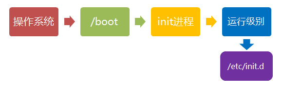

###1. 请参照手册的install的章节, 在虚拟机中安装最新稳定版的FreeBSD和Debian.
因为debian一直在用，以前也用过一段时间的freebsd，所以这部分的操作就没有再做。
###2. 观察Debian的系统启动过程, 如何从BIOS自检开始, 到最后服务的启动完成的

首先，进行通电bios自检,识别操作系统，然后进入操作系统

下面开始debian的整个启动过程:
- 第一步、加载内核

操作系统接管硬件以后，首先读入 /boot 目录下的内核文件。

/boot 目录下面的文件：

- 第二步、启动初始化进程

内核文件加载以后，就开始运行第一个程序 /sbin/init，它的作用是初始化系统环境。

由于init是第一个运行的程序，它的进程编号（pid）就是1。其他所有进程都从它衍生，都是它的子进程。

- 第三步、确定运行级别

init进程的一大任务，就是去运行这些开机启动的程序。但是，不同的场合需要启动不同的程序，比如用作服务器时，需要启动Apache，用作桌面就不需要。Linux允许为不同的场合，分配不同的开机启动程序，这就叫做"运行级别"（runlevel）。也就是说，启动时根据"运行级别"，确定要运行哪些程序。

Linux预置七种运行级别（0-6）。一般来说，0是关机，1是单用户模式（也就是维护模式），6是重启。运行级别2-5，各个发行版不太一样，对于Debian来说，都是同样的多用户模式（也就是正常模式）。

- 第四步、加载开机启动程序

前面提到，七种预设的"运行级别"各自有一个目录，存放需要开机启动的程序。不难想到，如果多个"运行级别"需要启动同一个程序，那么这个程序的启动脚本，就会在每一个目录里都有一个拷贝。
Linux的解决办法，就是七个 /etc/rcN.d 目录里列出的程序，都设为链接文件，指向另外一个目录 /etc/init.d ，真正的启动脚本都统一放在这个目录中。init进程逐一加载开机启动程序，其实就是运行这个目录里的启动脚本。

然后登陆。
####3. 观察FreeBSD的系统启动过程, 并比较一下和Debian的异同点
Freebsd的系统启动过程：

当我们接通PC机的电源之后，处理器会执行第一条指令，此时Linux引导是从BIOS的0xFFFF0 地址处开始的。第一条指令通常使处理器跳跃到BIOS的入口地址，然后BIOS就开始进行开机自检，即进行所谓的POST（Power On Self Test）操作，该操作包括对内存等硬件的检测。完成自检后，BIOS会根据设定好的启动设备和启动顺序来启动系统中的操作系统。

freebsd的启动主要分为三步：

- 第一阶段是运行MBR，它只知道把计算机带入一个特殊的状态；
- 第二阶段完成初始化；
- 第三阶段就完成加载操作系统的任务。

####4. 比较FreeBSD和Debian的文件目录结构和有什么异同
freebsd中的家目录是一个软链接
<pre><code style="color: #000000;">/ 文件系统的根目录
/bin/ 单用户和多用户环境下，用户使用的基本工具
/boot/ 操作系统启动过程中使用的程序和配置文件
/dev/ 设备节点
/etc/ 系统配置文件和脚本
/etc/mail/ 邮件传输代理的配置文件
/etc/namedb/ 域名服务器程序named的配置文件
/etc/periodic/ 每天、每周、每月运行的脚本
/etc/ppp/ ＰＰＰ配置文件
/mnt/ 用作临时加载点的空目录
/proc/ 进程文件系统
/root/ root帐户的主目录
/sbin/ 单用户和多用户环境下使用的系统程序和管理工具
/stand/ 在独立环境下使用的程序
/tmp/ 临时文件
/usr/ 主要是用户的工具和应用程序
/usr/bin/ 通常是工具和应用程序
/usr/include/ 标准Ｃ include文件
/usr/lib/ 文档库
/usr/libdata/ 各种工具的数据文件
/usr/libexec/ 系统守护程序和系统工具
/usr/local/ 本地可执行的程序和库等
/usr/obj/ 通过建立/usr/src目录树产生的特定结构的目标树
/usr/ports 这个不用说了。
/usr/sbin/ 系统守护程序和系统工具(由用户执行)
/usr/share/ 与特定平台无关的文件
/usr/src/ 本地源代码文件
/usr/X11R6/ X11R6发行的可执行程序、库等

/var/ 多种日志、临时文件和spool文件
/var/log/ 日志文件
/var/mail/ 用户邮箱文件
/var/spool/ 多种打印机和邮件系统spooling目录
/var/tmp/ 系统重启之间保存的临时文件
/var/yp NIS映射表
</pre></code>
debian系统的目录结构：
<pre><code style="color: #000000;">├── bin           基础系统所需要的最基础的命令
├── boot          内核及引导系统程序
│   └── grub    引导配置文件,如menu.lst 或grub.cfg都在里面
├── dev           设备文件
├── emul         
│   └── ia32-linux
├── etc           系统配置文件
├── home          普通用户家目录
├── initrd.img   
├── lib            动态链接共享库
├── lib32          32位库文件
├── lib64 -> /lib  库文件
├── lost+found     文件碎片
├── media          挂载储存设备的挂载目录
├── mnt            挂载储存设备的挂载目录
├── opt            可选安装目录
├── proc           进程信息及内核信息的内存映射
├── root           root的家目录
├── sbin           系统管理的命令
├── selinux        安全服务
├── srv            服务启动之后需要提取的数据
├── sys            内核设备树
├── tmp            临时文件
├── usr            应用程序和文件
│   ├── bin      系统用户使用的应用程序
│   ├── games    游戏
│   ├── include  开发和编译应用程序所需要的头文件 
│   ├── lib      常用的动态链接库和软件包的配置文件
│   ├── lib32    常用的动态链接库和软件包的配置文件32位
│   ├── lib64 -> lib
│   ├── local    本地安装的程序
│   ├── sbin     超级用户使用的比较高级的管理程序和系统守护程序
│   ├── share    系统共用
│   └── src      内核源代码
├── var
│   ├── backups  备份
│   ├── cache    应用程序的缓存文件
│   ├── lib      系统正常运行时要改变的文件
│   ├── local    /usr/local 中安装的程序的可变数据
│   ├── lock    锁定文件
│   ├── log     系统日志
│   ├── mail    邮件日志相关
│   ├── opt     opt目录的变量数据
│   ├── run     保存到下次引导前有效的关于系统的信息文件
│   ├── spool   打印机、邮件、代理服务器等假脱机目录
│   └── tmp     比/tmp 允许的大或需要存在较长时间的临时文件
└── vmlinuz
</pre></code>
####5. 学习Debian和FreeBSD基本的包管理操作, 通过下载二进制包的方式在两个系统上安装这些软件: redis, mtr
<pre><code style="color: #000000;">debian:
apt-get intsall redis mtr
freebsd:
pkg install redis
pkg install mtr
</pre></code>

####6. 学习Linux上最自由古老的安装包方式-源码编译安装: 请用源码编译方式安装redis, 对比包管理工具, 源码编译是如何管理安装路径的? 如何定义软件冲突的? 安装的软件在文件布局和使用上有什么区别?
<pre><code style="color: #000000;">源码编译安装：
tar zxf redis-3.0.6.tar.gz
cd redis-3.0.6/
make
cd src
cp redis-server /usr/bin/
cp redis-cli /usr/bin/
cp redis-check-aof /usr/bin/
cp redis-check-dump /usr/bin/
cp redis-benchmark /usr/bin/
cd ../utils/
./install_server.sh		#这里配置端口，配置文件，启动文件等等的配置
</pre></code>
可以在这里指定不同的端口，配置多实例，以防止出现软件冲突。使用包管理工具它是直接将软件安装到系统指定的目录，而使用源码安装就比较灵活，可以自己定义安装目录。

####7. 请把编译好的redis二进制文件制作成一个标准的deb包

可以使用debuild或pbuid

也可以在源码保重使用下面操作：
<pre><code style="color: #000000;">#dh_make
会出现如下目录结构，其中也有一些其他的文件，删除即可：
debian/
|
|----rules　　　　      很重要的一个文件，configure,make,make install等都被这个文件调用。
|----control           记录包的各种信息，比如维护者，描述，依赖关系等。
|----<package>.init    如果在rules中启用了dh_installinit，那么这个脚本在包安装后将命名为<package>并放到/etc/init.d/下。
|----<packgae>.preinst       在包安装前的一些操作。
|----<packgae>.postinst      在包安装后的一些操作。
|----<packgae>.prerm         在包删除前的一些操作。
`----<packgae>.postrm        在包删除后的一些操作。

fakeroot debian/rules binary
cd ..
du -sh redis_3.0.6-1_all.deb
8.0K	redis_3.0.6-1_all.deb		#看到这里感觉有点小问题，需要后面再看下
</pre></code>

####8. 请为redis编写一个标准的debian服务控制脚本.
<pre><code style="color: #000000;">#!/bin/sh
EXEC=/usr/local/bin/redis-server
CLIEXEC=/usr/local/bin/redis-cli
PIDFILE=/var/run/redis_6380.pid
CONF="/etc/redis/6380.conf"
REDISPORT="6380"

case "$1" in
    start)
        if [ -f $PIDFILE ]
        then
            echo "$PIDFILE exists, process is already running or crashed"
        else
            echo "Starting Redis server..."
            $EXEC $CONF
        fi
        ;;
    stop)
        if [ ! -f $PIDFILE ]
        then
            echo "$PIDFILE does not exist, process is not running"
        else
            PID=$(cat $PIDFILE)
            echo "Stopping ..."
            $CLIEXEC -p $REDISPORT shutdown
            while [ -x /proc/${PID} ]
            do
                echo "Waiting for Redis to shutdown ..."
                sleep 1
            done
            echo "Redis stopped"
        fi
        ;;
    status)
        PID=$(cat $PIDFILE)
        if [ ! -x /proc/${PID} ]
        then
            echo 'Redis is not running'
        else
            echo "Redis is running ($PID)"
        fi
        ;;
    restart)
        $0 stop
        $0 start
        ;;
    *)
        echo "Please use start, stop, restart or status as first argument"
        ;;
esac
</pre></code>

####9. 请在两台机器上安装好pip后, 配置其使用阿里云的pypi源, 安装requests这个库.
<pre><code style="color: #000000;">pip install requests -i http://mirrors.aliyun.com/pypi/simple

配置全局设置：
vim ~/.pip/pip.conf
[global]
timeout = 6000
index-url = http://mirrors.aliyun.com/pypi/simple/

pip install requests --upgrade
</pre></code>