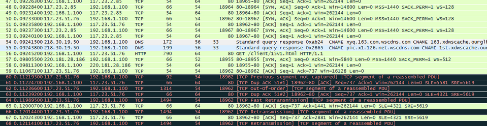

####
1. 打开游戏客户端后, 游戏客户端要连接哪些服务器和端口?

&nbsp;&nbsp;&nbsp;&nbsp;&nbsp;&nbsp;打开游戏客户端后，游戏客户端会连接客户端首先会连接DNS服务器得到游戏客户端更新服务器的ip地址，然后通过得到的这个ip连接客户端服务器，通过客户端服务器的80端口返回数据，并显示客户端是否已经更新，及一些推荐活动，玩家动态，防盗指南，公告，及用户指南等的一些信息，使用wireshark抓取所连接服务器的信息如下：

####
2.游戏客户端如何得到游戏服务器的IP地址和端口?

&nbsp;&nbsp;&nbsp;&nbsp;&nbsp;&nbsp;此时我们会看到客户端会通过192.168.1.100这块网卡发出DNS请求来解析xyq.163.com这个域名所对应的服务器ip:

首先，在这之前会在自己的本地缓存中找这个域名对应的ip缓存信息，如果没有，则会向DNS服务器发出请求，通过不同中转DNS服务器最终通过他的A记录得到实际对应的服务器ip然后返回给客户端，客户端通过这个ip再去访问游戏客户端服务器整个过程中最中得到解析的DNS服务器的ip和端口号，游戏客户端服务器ip和端口号信息如下：

- 这里DNS服务器地址为：218.30.19.50 端口：53

- 解析到的游戏服务器的IP地址为：117.23.51.76 连接端口:80

在上面截图中我们所看到的是他的别名，下面我们可以看一下详细信息：

####
3.用户密码的校验过程中, 会连接哪些服务器和端口?

用户密码校验的时候，会连接login服务器

此时通过访问的服务器IP：123.58.184.229 对应访问的端口号为：11566

验证完成后会连接服务器：220.181.112.122 对应端口为：80

####
4.登录进入游戏后, 在游戏过程中, 游戏客户端会连接哪些服务器和端口?

在游戏过程中游戏客户端会连接游戏场景服务器，和数据库服务器，在这里可能是同一台服务器，其中下面是对应的ip和端口号：

123.58.184.299	访问端口号：11566
####
5.退出客户端时, 客户端访问了哪些服务器和端口?

<pre><code class="shell" style="color: #000000;">ip地址	        端口
111.221.29.254  443
220.181.7.190	80
</pre></code>
####
6.游戏里有哪些分区和服,向导师讲述你对分区和服这两个概念的理解?

&nbsp;&nbsp;&nbsp;&nbsp;&nbsp;&nbsp;在游戏中我们经常会看看到同一地域有不同的区，例如我们看到的广东1区、2区、3区、4区，在区下面才是真正的游戏服务器，如果两个玩家通过客户端登陆的是同一个区，则他们会进入同一组服务器进行pk，否则，如果不在同一个区，则不会进入同一组服务器，连见面的机会都没有。在区下面的服务器数量则是由在这个区的玩家数量和每台服务器所能承受的最大访问量来定，在梦幻西游这个游戏中，我们所能看到的战区列表如下：

####
7.玩家看到的游戏服,背后由多少台物理服务器组成?

&nbsp;&nbsp;&nbsp;&nbsp;&nbsp;&nbsp;就以广东地区来说，划分出来了4个区，在每个区下面都是有一组或多组服务器，玩家看到的游戏服，每组服务器中都会有游戏登陆服务器、数据库服务器、游戏服务器，为了保证玩家数据的完整性，一般数据库服务器会多于两台。

####
8.如果玩家连不上游戏,客户端提供哪些途径让玩家反馈问题? 尝试运行这样的工具,看看输出有哪些信息?

上面三种情况为客户端网络故障

还有一种情况就是在玩家输入账号密码后进行验证的时候，显示服务器正在登陆但是一直不能进入游戏界面，这种情况可能是由于网络问题，也有可能是该区服务器玩家爆满，这时候我们就要调节一下游戏服务器的玩家上限，设置一个可预期的值。
