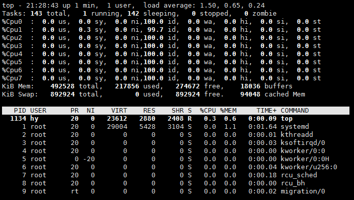
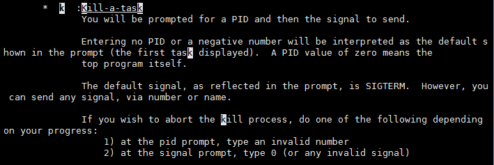
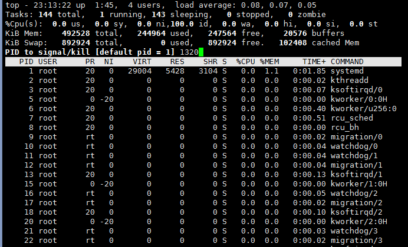
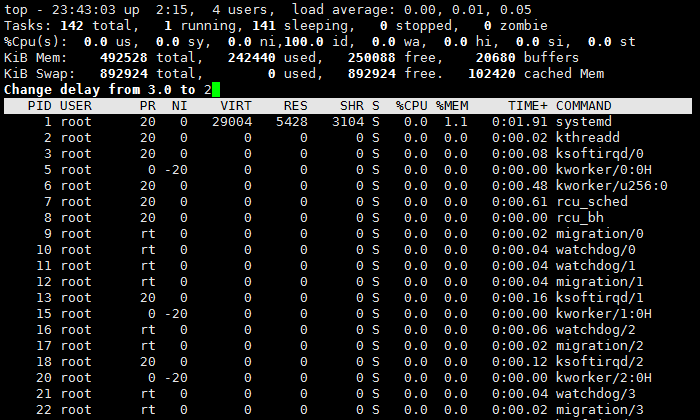

###日常命令：top ssh find grep
###top
命令参数：
<pre><code style="color: #000000;">top [参数]
-b： 批处理模式。通常用在脚本中，不断输出信息
-c： 显示包含路径的命令行，而不只是程序名称
-d： 指定信息刷新的时间间隔（默认是3s）
-i： 不显示闲置或者僵死进程
-n： 指定显示的次数。一般与-b搭配使用
-p： 指定进程号。可以指定多个pid
-s： 使top命令在安全模式中运行
-S： 指定累积模式，每个进程的CPU时间为该进程及关闭的子进程锁累加的时间
-u： 指定用户名
</pre></code>
####1.如何将top的输出通过管道交给另一个进程?

我们可以使用-n这个参数指定它循环显示的次数，然后通过输出后面接管道就可以传递给另外一个进程。

####2.如何让top显示每一个CPU的使用情况?
<pre><code style="color: #000000;">hy@debian:~$ top
然后按1

</pre></code>
####3.如何在top里杀进程
<pre><code style="color: #000000;">通过man手册我们可以看到如下信息：

首先，我们执行一个python脚本，然后得到它的pid
hy@debian:~/py$ ./hello.py 
hy@debian:~$ ps -ef |grep hello
hy         1352   1320  0 23:11 pts/3    00:00:00 python ./hello.py
再使用top
hy@debian:~$ top
然后按k，输入进程的pid回车

</pre></code>
####4.top的默认刷新时间是多少? 如何修改这个默认设置?
默认刷新时间是3s，要进行修改可以有两种办法：
第一种：使用top -d [时间间隔]
第二种：使用top命令进入后，按d设置：
<pre><code style="color: #000000;">hy@debian:~$ top

</pre></code>
####5.top里的load average是如何计算的?
我们看到top命令后的第一行：
<pre><code style="color: #000000;">
</pre></code>
解释一下上面的这个值都是怎么来的：
<pre><code style="color: #000000;">load average: 0.00, 0.02, 0.05： 系统1分钟、5分钟、15分钟的平均CPU负载信息
top：  表示为top的指令
00:07:32： 表示系统当前时间
up  2:40： 系统开机到现在经过了多长时间
4 users： 当前用户数
</pre></code>
计算公式：
<pre><code style="color: #000000;">load(t) = load(t-1) e^(-5/60) + n (1 - e^(-5/60))迭代计算，其中n为run-queue length。
</pre></code>
下面说一下第二行：
<pre><code style="color: #000000;">Tasks:  141 total,   1 running,  140 sleeping,   0 stopped,   0 zombie
Tasks：  任务
141 total：  当前进程总数
1 running：  正在运行的进程数
140 sleeping：  睡眠进程数量
0 stopped：  停止的进程数
0 zombie：  僵死进程数
</pre></code>
####6.假设top显示ffmpeg进程的CPU使用率为143.7%, 请具体解释这个数值是如何计算出来的.
ffmpeg进程可能是一个多进程的运行程序，利用了多个cpu，而top命令显示的是多个cpu占用率的总和，所以它在显示的时候超过了100%。
####7.第四列的NI是什么意思?

NI代表用户某个进程优先级，它的范围为-20到19，-20为最高优先级，19为最低优先级。

其他字段的意思：
<pre><code style="color: #000000;">PID：  进程的ID(进程的唯一标识符)
USER： 该进程所属用户
PR：   进程调度的优先级（值越小越优先被执行，RT表示正在运行中)
NI：   进程的nice值。(范围-20到19，值越小越优先被执行)
VIRT： 进程使用的虚拟内存总量(单位kb，VIRT=SWAP+RES)
RES：  进程占用的物理内存。(单位kb。RES=CODE+DATA。%MEM 所显示的是由此列的值)
SHR：  进程使用的共享内存。(单位kb) 
S：    进程的状态。主要有以下几种：
    D.不可中断的休眠
    S.休眠
    R.正在运行
    T.被跟踪或已停止
    Z.僵死状态(僵尸进程)
%CPU： 进程占用的CPU百分比
%MEM： 进程占用的物理内存的百分比(以RES列的值为标准)
TIME+：进程启动后占用的总的CPU时间。(单位1/100秒) 
COMMAND： 进程启动命令名称
</pre></code>
###ssh:
####1. 请简要叙述ssh连接加密的原理

ssh连接是CS模型（客户端-服务器），客户端发出连接申请，服务器对客户端进行验证，再考虑是否接受连接申请。ssh的安全加密方式的理论基础是非对称加密体系，采用rsa加密算法。

ssh有两种级别的安全验证：账户口令验证、rsa加密验证

######账号口令验证：

直接输入所要登陆的用户的口令是默认的方式。不需要修改配置文件。

如果直接从客户端将用户密码传输到服务器，那么密码信息很容易被中间人截获，从而实现重放攻击。ssh的实现方式是：

- 1.客户端向ssh服务器发出请求，服务器将自己的公钥返回给客户端；
- 2.客户端用服务器的公钥加密自己的登录密码，再将信息发送给服务器；
- 3.服务器接收到客户端传送的密码，用自己的私钥解码，如果结果正确，则同意登录，建立起连接。

这种方式还是有漏洞的，中间人可以假扮成服务器，骗取客户端的密码。

######RSA加密验证:
rsa加密验证方式，充分利用了非对称加密体系的优势，不需要在网络传输密码，完全杜绝了中间人攻击的可能。步骤如下：
<pre><code style="color: #000000;">hy@debian:~$ ssh-keygen	#生成密钥对，按照默认配置，私钥会被保存在~/.ssh/id_rsa中，公钥则在~/.ssh/id_rsa.pub中。
hy@debian:~$ ssh-copy-id username@domain
客户端通过安全的方式将公钥发送给服务器。在服务器端，将客户端发的公钥写入到~/.ssh/authorized_keys文件末尾。
另外一种方式是将id_rsa.pub中的指纹复制一份，直接追加到服务器的~/.ssh/authorized_keys末尾。
</pre></code>
建立连接：

- 1.客户端发出申请。服务器产生session密钥对，返回通过对应客户端的公钥加密后的session公钥。
- 2.客户端用自己的密钥解密信息，得到session公钥。
- 3.之后的数据交互，都通过对方方公钥加密，对方收到信息后，用其私钥解密，实现安全加密过程。
####2. 请简述ssh agent forward的原理.
1. 用户在生成ssh密钥的时候输入passphrase密码，对生成的密钥进行加密
2. 在每次ssh连接的时候都必须输入passphrase密码，这样相对就比较麻烦，先让bash运行ssh-agent后对ssh-agent的输出进行计算。shell以这种调用方式（使用反引号，而不是普通的单引号）设置并导出SSH_AGENT_PID及SSH_AUTH_SOCK变量，使这些变量对于您在登录会话期间启动的所有新进程都可用。
3. 但是ssh-agent启动时高速缓存当然是空的，里面不会有解密的专用密钥。在我们真能使用ssh-agent之前，首先还需要使用ssh-add命令把我们的专用密钥添加到ssh-agent的高速缓存中。下面的示例中，我使用ssh-add把我的~/.ssh/identity专用RSA密钥添加到ssh-agent的高速缓存中。

具体操作过程：

<pre><code style="color: #000000;">hy@debian:~$ ssh-agent bash	#开启一个新的bash shell层
hy@debian:~$ ps		#用ps命令我们可以看到有两个bash在运行
   PID TTY          TIME CMD
  1022 pts/0    00:00:00 bash
  1187 pts/0    00:00:00 bash
  1193 pts/0    00:00:00 ps
hy@debian:~$ ssh-add 	#让刚启动的bash记录密钥密码，这里的私钥文件是默认的，如果我们之前指定了名称就需要指定私钥文件。
Enter passphrase for /home/hy/.ssh/id_rsa: 	输入密钥密码（无回应）
Identity added: /home/hy/.ssh/id_rsa (/home/hy/.ssh/id_rsa)
hy@debian:~$ ssh hy@192.168.31.139	#在当前的bash中连接目标主机不需要密钥密码

The programs included with the Debian GNU/Linux system are free software;
the exact distribution terms for each program are described in the
individual files in /usr/share/doc/*/copyright.

Debian GNU/Linux comes with ABSOLUTELY NO WARRANTY, to the extent
permitted by applicable law.
You have mail.
Last login: Sun Dec 20 02:03:18 2015 from 192.168.31.143
hy@debian:~$ sudo ifconfig eth0		#这时我们已经看到了已经连接到了139这台主机
eth0      Link encap:Ethernet  HWaddr 00:0c:29:b3:f6:40  
          inet addr:192.168.31.139  Bcast:192.168.31.255  Mask:255.255.255.0
          inet6 addr: fe80::20c:29ff:feb3:f640/64 Scope:Link
</pre></code>
####3. ssh连接时如何指定远程端口, 如何设置连接超时时间?
<pre><code style="color: #000000;">client连接server，在client上：
$ssh -p 端口 主机		#指定端口连接
\# vim /etc/ssh/sshd_config
ServerAliveInterval 60		#超时时间设置
server端的端口设置，是在配置文件中设置：
\# vim /etc/ssh/sshd_config
# What ports, IPs and protocols we listen for
Port 22		#指定端口
ClientAliveInterval 60		#客户端来连接的超时设置
</pre></code>
修改完成后重启ssh服务。
####4. ssh私钥文件默认的权限是什么?
600
####5. 如何利用ssh来进行端口转发?

通常情况下两个不同的网络之间总会开放某一些特定的端口用于通讯使用，而SSH所使用的22端口通常就在开放之列。基于SSH的端口转发就是利用SSH作为中间的代理，达到绕过两个网络之间的限制，顺利的进行任意的端口的访问。

端口转发可以分为三种，正向端口转发，反向端口转发和动态端口转发。

- 正向端口转发

假设主机a上面安装有数据库服务，监听的端口是8888，如果我想通过xiyou域中的主机b直接访问a主机中的数据库那该怎么办呢？这就要用到SSH的正向端口功能了。在这先要说明一下，在Linux中，所有的端口转发的操作都可以通过使用自带的工具ssh来完成。

<pre><code style="color: #000000;">$ ssh -L 8000:a.example.com:8888 oracle@c.example.com -N
</pre></code>
`参数-L：`

表示在本地开启监听的端口，后面紧跟的参数格式为::，表示将本地的8000端口转发到远程主机a的8888端口。

oracle@c.example.com：这个参数指定要使用ssh登录的主机以及登录的用户名，这里使用的主机和前一个参数中的主机必须是在同一个网域当中，并且能相互访问，当然也可以是同一个机器。

`参数-N`

不执行远程的命令。这个参数在这里是可选的。

- 反向端口转发
<pre><code style="color: #000000;">$ ssh -R 8888:localhosthost-b.office.mycompany.com:22 oracle@host-c.prod.mycompany.com -N
参数-R
创建一个反向的端口转发，后面紧跟的参数格式为 ::，这里监听的端口是8888，反向连接要到C主机原来根本无法访问的主机B的22端口。
oracle@host-c.prod.mycompany.com
这个参数指定要使用ssh登录的主机以及登录的用户名，这里使用的主机和前一个参数中的主机必须是在同一个网域当中，并且能相互访问，当然也可以是同一个机器。
参数-N
不执行远程的命令。这个参数在这里是可选的。
在主机A上面执行上面的命令成功之后就可以登录到主机C检查一下效果了，首先是检查8888端口的开发状态：
</pre></code>
###find:
####1. find能根据哪些条件来查找文件.

find命令是根据文件的属性进行查找，如文件名，文件大小，所有者，所属组，是否为空，访问时间，修改时间等。

####2. find能否根据文件内容来搜索. 为什么?

不能，若跟据文件的内容进行查找，需使用grep命令。

####3. find可以如何删除找到的文件? 请提供三种方法.
<pre><code style="color: #000000;">find ./ -name filename | xargs rm -rf 
find . -name filename -ok rm {} \;
find ./ -type f -name "filename" -exec rm -rf { } \;
-ok和-exec行为一样，不过它会给出提示，是否执行相应的操作。
</pre></code>
####4. 请简述mtime, ctime, atime的区别.
UNIX/Linux文件系统每个文件都有三种时间戳： 
访问时间(Access time)（-atime/天，-amin/分钟）：用户最近一次访问时间。 
修改时间(Modified time)（-mtime/天，-mmin/分钟）：文件最后一次修改时间。 
变化时间(Create time)（-ctime/天，-cmin/分钟）：文件数据元（例如权限等）最后一次修改时间。
####5. -type中有哪些常见类型?
find . -type 类型参数
<pre><code style="color: #000000;">类型参数：
f 普通文件 
l 符号连接 
d 目录 
c 字符设备 
b 块设备 
s 套接字 
p Fifo
</pre></code>
###grep:
####1. 请了解-c/-v/-A/-B/-C/-E/-n/-i/-R参数的意义.
<pre><code style="color: #000000;">-c 计算符合范本样式的列数。
-v 反转查找。
-A 显示匹配行之后的N行
-B 显示匹配行之前的N行
-C 显示匹配行前后的N行
-E 使用扩展正则表达式
-n 在输出时显示行号
-i 进行大小写无关的搜索
-R 递归搜索全部的文件
</pre></code>
####2. 对于-q/-o参数, 给出具体的使用场景.
-q:安静模式，不会输出任何信息，如果匹配到过滤的信息返回非零，如果没匹配到则返回0值。一般用于条件测试。
实例：
<pre><code style="color: #000000;">hy@debian:~/py$ cat file 
tom
jack
hello
hy@debian:~/py$ if grep -q hello file;then echo yes;else echo no;fi
yes
hy@debian:~/py$ if grep -q "web" file;then echo yes;else echo no;fi
no
</pre></code>
-o:只输出文件中匹配到的部分。
比如我们可以统计一个Apache访问日志中某个url的访问量最大，进行统计的时候
##基础命令: ls df du touch ps
###ls:
####1. 对于ls -l的输出中的一列, 给出每个字符的含义.
<pre><code style="color: #000000;">第1行:总计(total)
下面个字段的意思
第1字段：文件属性字段
第2字段：文件链接数
第3字段：文件（目录）拥有者
第4字段:文件（目录）拥有者所在的组
第5字段:文件所占用的空间(以字节为单位)
第6字段：文件（目录）最近访问（修改）时间
第7字段：文件名
</pre></code>
####2. 目录的大小是什么意思?

显示的是目录本身作为一个文件所占据的磁盘空间大小

可以使用：ls -ldh dirname查看

####3. ls默认的排序方式是什么? 有哪些参数能改变这一行为?
<pre><code style="color: #000000;">ls -l默认按文件名排序，并且是按照字典顺序排序
ls -lt 加-t参数按时间顺序排序列出
ls -ltr 加-r参数指按时间反向排序，最近修改的在最前面
ls -lS 加-S参数按文件的大小的降序输出
ls -lSr 按照文件大小的升序排序输出
</pre></code>
####4. 对于-R/-i参数, 请给出具体的使用场景.
\-R：递归处理，将指定目录下的所有文件及子目录一并处理；
\-i：显示文件索引节点号（inode）。一个索引节点代表一个文件；
###df/du:
####1. 如何显示inode占用率?
我们可以使用df -i进行查看
<pre><code style="color: #000000;">hy@Aaron:~$ df -i
Filesystem       Inodes  IUsed    IFree IUse% Mounted on
/dev/sda9      12500992 855735 11645257    7% /
none             986487     15   986472    1% /sys/fs/cgroup
udev             982598    679   981919    1% /dev
tmpfs            986487    862   985625    1% /run
none             986487     10   986477    1% /run/lock
none             986487    159   986328    1% /run/shm
none             986487     34   986453    1% /run/user
/dev/sda8        122400    317   122083    1% /boot
/dev/sda1             0      0        0     - /boot/efi
</code></pre>
####2. 如何显示文件系统的类型?
我们可以使用-T参数：
<pre><code style="color: #000000;">hy@Aaron:~$ df -lhT
Filesystem     Type      Size  Used Avail Use% Mounted on
/dev/sda9      ext4      188G   78G  102G  44% /
none           tmpfs     4.0K     0  4.0K   0% /sys/fs/cgroup
udev           devtmpfs  3.8G  4.0K  3.8G   1% /dev
tmpfs          tmpfs     771M  1.4M  770M   1% /run
none           tmpfs     5.0M  4.0K  5.0M   1% /run/lock
none           tmpfs     3.8G   88M  3.7G   3% /run/shm
none           tmpfs     100M   56K  100M   1% /run/user
/dev/sda8      ext4      454M  225M  202M  53% /boot
/dev/sda1      vfat       99M   29M   71M  30% /boot/efi
</code></pre>
####3. 什么情况下用rm删除了一个大文件, df显示的空余大小会没有变化.
在Linux或者Unix系统中，通过rm或者文件管理器删除文件将会从文件系统的文件夹结构上解除链接(unlink).然而假设文件是被打开的（有一个进程正在使用），那么进程将仍然能够读取该文件，磁盘空间也一直被占用，这时我们使用rm删除了一个大文件，df显示的空间大小会没有变化。
####4. 如何仅仅显示某个目录下文件的总大小.
我们可以使用du -sh dirname来查看。
<pre><code style="color: #000000;">hy@Aaron:~$ du -sh tools
189M    tools
</code></pre>
####5. 请解释如何产生一个文件空洞.

&nbsp&nbsp&nbsp&nbsp&nbsp&nbsp在UNIX文件操作中，文件位移量可以大于文件的当前长度，在这种情况下，对该文件的下一次写将延长该文件，并在文件中构成一个空洞，这一点是允许的。位于文件中但没有写过的字节都被设为0.

###touch:
####1. 请给出使用touch来修改文件修改时间的具体使用场景.
在写一个定时任务的时候是需要删除三个月前的文件，但是不想删除其中的某些文件，这时我们就可以通过修改文件本身的建立时间来达到目的，这里我们就用到touch命令，通过man手册我们可以看到使用d参数来实现，帮助信息如下：

<pre><code style="color: #000000;">-d, --date=STRING
              parse STRING and use it instead of current time
              使用指定的日期时间，而非现在的时间。
-t STAMP
              use [[CC]YY]MMDDhhmm[.ss] instead of current time
使用指定的时间值 time 作为指定文件相应时间戳记的新值．此处的 time规定为如下形式的十进制数: [[CC]YY]MMDDhhmm[.SS] 
</code></pre>

命令参数：
<pre><code style="color: #000000;">-a   或--time=atime或--time=access或--time=use 　只更改存取时间。
-c   或--no-create 　不建立任何文档。
-d 　使用指定的日期时间，而非现在的时间。
-f 　此参数将忽略不予处理，仅负责解决BSD版本touch指令的兼容性问题。
-m   或--time=mtime或--time=modify 　只更改变动时间。
-r 　把指定文档或目录的日期时间，统统设成和参考文档或目录的日期时间相同。
-t 　使用指定的日期时间，而非现在的时间。
--no-create 不会建立新档案。 
--help 列出指令格式。 
--version 列出版本讯息。
</code></pre>
####2. touch对目录是否有效?
touch也可以修改目录的时间，创建目录我们使用mkdir。
####3. 如果文件不存在, 如何避免创建文件?
我们可以使用-c参数，如下：

###ps:
####1. ps auxww默认是按照什么进行排序的?
auxww的意思：a选项显示出所有运行进程的内容，而不仅仅是您的进程。u选项显示出进程所归属的用户名字以及内存使用，x选项显示出后台进程。 而ww选项表示为ps(1)把每个进程的整个命令行全部显示完，而不是由于命令行过长就把它从屏幕上截去。
####2. 如何用ps来查看进程树?
我们可以使用pstree进行查看进程树
####3. 如何用ps来查看单个线程的资源使用情况?

####4. ps auxww中的ww有什么使用场景?
当我们需要打印出每个进程的整个命令行全部显示在屏幕上的时候我们就可以使用ww。

##文本处理：cut  sort tail/head

###cut:
####1. cut默认的分隔符是什么? 如何设置分隔符?
cut默认的分隔符是tab，我们可以使用-d参数给它指定分隔符
用法：
<pre><code style="color: #000000;">-b：仅显示行中指定直接范围的内容；
-c：仅显示行中指定范围的字符；
-d：指定字段的分隔符，默认的字段分隔符为“TAB”；
-f：显示指定字段的内容； 
-n：与“-b”选项连用，不分割多字节字符； 
--complement：补足被选择的字节、字符或字段； 
--out-delimiter=<字段分隔符>：指定输出内容是的字段分割符； 
--help：显示指令的帮助信息； 
--version：显示指令的版本信息。
</code></pre>

####2. 对于每一行, 如何让cut仅显示第3到第5列?
我们可以使用-f参数，如下：
<pre><code style="color: #000000;">hy@Aaron:~$ cat /etc/passwd |cut -d ':' -f 3-5
0:0:root
1:1:daemon
2:2:bin
3:3:sys
4:65534:sync
</code></pre>
另外还有下面的用法，切割出3-5列及第7列：
<pre><code style="color: #000000;">hy@Aaron:~$ cat /etc/passwd |cut -d : -f 3-5,7
0:0:root:/bin/bash
1:1:daemon:/usr/sbin/nologin
2:2:bin:/usr/sbin/nologin
3:3:sys:/usr/sbin/nologin
4:65534:sync:/bin/sync
5:60:games:/usr/sbin/nologin
</code></pre>

####3. 对于每一行, 如何让cut仅显示第10到第15个字符?
我们可以使用-b参数：
<pre><code style="color: #000000;">hy@Aaron:~$ cat /etc/passwd |cut -c 10-15
0:root
1:1:da
:bin:/
:sys:/
</code></pre>
####4. 在什么情况下, -c和-b的输出有区别?
- -b ：以字节为单位进行分割。这些字节位置将忽略多字节字符边界，除非也指定了 -n 标志。一汉字距离最为明显
- -c ：以字符为单位进行分割。

###sort:
sort将文件的每一行作为一个单位，相互比较，比较原则是从首字符向后，依次按ASCII码值进行比较，最后将他们按升序输出。
####1. 如何对每行第3列进行排序?
我们可以使用-k参数指定列数：
<pre><code style="color: #000000;">hy@Aaron:~$ cat /etc/passwd | sort -t : -k3
root:x:0:0:root:/root:/bin/bash
hy:x:1000:1000:hy,,,:/home/hy:/bin/bash
syslog:x:100:103::/home/syslog:/bin/false
uucp:x:10:10:uucp:/var/spool/uucp:/usr/sbin/nologin
messagebus:x:101:105::/var/run/dbus:/bin/false
uuidd:x:102:107::/run/uuidd:/bin/false
</code></pre>
####2. 请给出具体例子说明什么情况下使用了-n会导致sort的输出和不加-n不一致.
与上面相比我们使用了-n后它是以数值大小进行排序的，而不适用\-n它是以字符串的第一个字符大小进行升序排序的，如果第一个字符一样再比较第二个字符
<pre><code style="color: #000000;">hy@Aaron:~$ cat /etc/passwd | sort -t : -k3 -n
root:x:0:0:root:/root:/bin/bash
daemon:x:1:1:daemon:/usr/sbin:/usr/sbin/nologin
bin:x:2:2:bin:/bin:/usr/sbin/nologin
sys:x:3:3:sys:/dev:/usr/sbin/nologin
sync:x:4:65534:sync:/bin:/bin/sync
games:x:5:60:games:/usr/games:/usr/sbin/nologin
man:x:6:12:man:/var/cache/man:/usr/sbin/nologin
lp:x:7:7:lp:/var/spool/lpd:/usr/sbin/nologin
hy@Aaron:~/Documents/website/socket$ cat /etc/passwd |sort -t ':' -k 6.2,6.4 -k 1r #对/etc/passwd,先以第六个域的第2个字符到第4个字符进行正向排序，再基于第一个域进行反向排序
</code></pre>

####3. 请了解-u/-r的意义.
<pre><code style="color: #000000;">-u     with -lt: sort by, and show, access time; with -l: show access time and sort by name; otherwise: sort by access time
       进行去重操作
-r, --reverse
              reverse order while sorting
              -r：以相反的顺序来排序；

hy@Aaron:~/Documents/website/socket$ cat file 
hello
hello
12345
123
123
1
tom
jack
jack
hy@Aaron:~/Documents/website/socket$ sort -u file
1
123
12345
hello
jack
tom
查看/etc/passwd有多少个shell:对/etc/passwd的第七个域进行排序，然后去重：
hy@Aaron:~/Documents/website/socket$ cat /etc/passwd |sort -t ':' -k 7 -u  
root:x:0:0:root:/root:/bin/bash
syslog:x:100:103::/home/syslog:/bin/false
sync:x:4:65534:sync:/bin:/bin/sync
nvidia-persistenced:x:120:130:NVIDIA Persistence Daemon,,,:/:/sbin/nologin
daemon:x:1:1:daemon:/usr/sbin:/usr/sbin/nologin
</code></pre>

####4. 默认的分隔符是什么? 如何指定分隔符?
sort默认的分隔符是空格，如果要指定成其他的可以使用`-t`进行指定
####5. 请给出-T参数的使用场景.
<pre><code style="color: #000000;">-T, --temporary-directory=DIR
              use DIR for temporaries, not $TMPDIR or /tmp; multiple options specify multiple directories
-T, --temporary-directory=目录        使用指定目录而非$TMPDIR 或/tmp 作为临时目录，可用多个选项指定多个目录

sort在排序的时候如果排序的文件比较大，一次排不完，占用内存比较大，所以要找一个临时的目录存放它排序过程中产生的临时文件，排完序后就会将临时文件删除。
例子：
hy@Aaron:~/Documents/website/socket$ cat /etc/passwd |sort -t ':' -T hello  #指定一个hello这个目录为临时文件保存目录
</code></pre>

<pre><code style="color: #000000;">sort常用参数：
-b：忽略每行前面开始出的空格字符； 
-c：检查文件是否已经按照顺序排序； 
-d：排序时，处理英文字母、数字及空格字符外，忽略其他的字符； 
-f：排序时，将小写字母视为大写字母； 
-i：排序时，除了040至176之间的ASCII字符外，忽略其他的字符； 
-m：将几个排序号的文件进行合并； 
-M：将前面3个字母依照月份的缩写进行排序； 
-n：依照数值的大小排序； 
-o<输出文件>：将排序后的结果存入制定的文件，这里可以是原文件，而重定向只能输入到一个新的文件或者其他文件中； 
-r：以相反的顺序来排序； 
-t<分隔字符>：指定排序时所用的栏位分隔字符； 
-u：排序并去重相当于uniq；
+<起始栏位>-<结束栏位>：以指定的栏位来排序，范围由起始栏位到结束栏位的前一栏位。
</code></pre>

###tail/head:
####1. 如何取得一个文件的前几个字符?
<pre><code style="color: #000000;">head -c NUM filename
</code></pre>
这样就取出了文件的前NUM个字符
####2. tail -f是干什么的?
-f或；--follow：显示文件最新追加的内容。“name”表示以文件名的方式监视文件的变化。“-f”与“-fdescriptor”等效；
默认输出10行。
####3. 如何用tail显示从第25行开始, 显示一个40多行(不知道具体数目)的文件的内容?
<pre><code style="color: #000000;">$ tail -n+25 kern.log
</code></pre>

####4. 请提供两种不同的办法来打印一个文件的第50行内容.
<pre><code style="color: #000000;">第一种：
cat filename |head -n 50 |tail -n 1
第二种，可以使用awk进行过滤：
cat kern.log  |awk '{if(NR==50){print}}'
</code></pre>
更多的参数列表
<pre><code style="color: #000000;">tail参数：
--retry：即是在tail命令启动时，文件不可访问或者文件稍后变得不可访问，都始终尝试打开文件。使用此选项时需要与选项“——follow=name”连用； 
-c或——bytes=：输出文件尾部的N（N为整数）个字节内容； 
-f或；--follow：显示文件最新追加的内容。“name”表示以文件名的方式监视文件的变化。“-f”与“-fdescriptor”等效； 
-F：与选项“-follow=name”和“--retry"连用时功能相同； 
-n或——line=：输出文件的尾部N（N位数字）行内容。 
--pid=<进程号>：与“-f”选项连用，当指定的进程号的进程终止后，自动退出tail命令； 
-q或——quiet或——silent：当有多个文件参数时，不输出各个文件名； 
-s<秒数>或——sleep-interal=<秒数>：与“-f”选项连用，指定监视文件变化时间隔的秒数； 
-v或——verbose：当有多个文件参数时，总是输出各个文件名； 
--help：显示指令的帮助信息； 
--version：显示指令的版本信息。

head参数：
-n<数字>：指定显示头部内容的行数； 
-c<字符数>：指定显示头部内容的字符数； 
-v：总是显示文件名的头信息； 
-q：不显示文件名的头信息。
</code></pre>

##机器维护：iostat netstat vmstat
###iostat:
####1. 直接无参数启动这个命令, 能得到哪些数据?
直接使用iostat命令将显示所有设备负载情况：
<pre><code style="color: #000000;">hy@Aaron:~$ iostat
Linux 3.16.0-41-generic (Aaron)     2015年12月26日     _x86_64_    (8 CPU)

avg-cpu:  %user   %nice %system %iowait  %steal   %idle
           2.11    0.05    0.61    0.52    0.00   96.71

Device:            tps    kB_read/s    kB_wrtn/s    kB_read    kB_wrtn
sda              17.79        86.95       211.39    1787803    4346757
dm-0              0.02         0.10         0.00       2056          0
dm-1              0.01         0.05         0.00       1032          0
dm-2              0.03         0.11         0.00       2292          0
dm-3              0.01         0.05         0.00       1032          0
dm-4              0.01         0.05         0.00       1032          0
dm-5              0.05         0.20         0.00       4104          0
dm-6              0.01         0.05         0.00       1032          0
dm-7              0.00         0.00         0.00         84          0
dm-8              0.01         0.05         0.00       1032          0
dm-9              0.01         0.04         0.00        788          0
dm-10             0.01         0.05         0.00       1032          0
dm-11             0.30         1.21         0.00      24920          0
dm-12             0.01         0.05         0.00       1032          0
</code></pre>
各字段说明：
<pre><code style="color: #000000;">%user：CPU处在用户模式下的时间百分比。
%nice：CPU处在带NICE值的用户模式下的时间百分比。
%system：CPU处在系统模式下的时间百分比。
%iowait：CPU等待输入输出完成时间的百分比。
%steal：管理程序维护另一个虚拟处理器时，虚拟CPU的无意识等待时间百分比。
%idle：CPU空闲时间百分比。

备注：如果%iowait的值过高，表示硬盘存在I/O瓶颈，%idle值高，表示CPU较空闲，如果%idle值高但系统响应慢时，有可能是CPU等待分配内存，此时应加大内存容量。%idle值如果持续低于10，那么系统的CPU处理能力相对较低，表明系统中最需要解决的资源是CPU。
</code></pre>
常用参数：
<pre><code style="color: #000000;">-c：仅显示CPU使用情况； 
-d：仅显示设备利用率； 
-k：显示状态以千字节每秒为单位，而不使用块每秒； 
-m：显示状态以兆字节每秒为单位； 
-p：仅显示块设备和所有被使用的其他分区的状态； 
-t：显示每个报告产生时的时间； 
-V：显示版号并退出； 
-x：显示扩展状态。
</code></pre>
####2. 如何持续监控某块硬盘的读写情况?
<pre><code style="color: #000000;">hy@Aaron:~$ iostat 1  #表示每隔1秒刷新一次，持续监控
hy@Aaron:~$ iostat 1 10 #表示每隔1秒刷新一次，刷新10次

为了更加详细，我们可以加-x参数：
hy@Aaron:~$ iostat -x 
Linux 3.16.0-41-generic (Aaron)         2015年12月26日  _x86_64_        (8 CPU)

avg-cpu:  %user   %nice %system %iowait  %steal   %idle
           2.15    0.05    0.64    0.50    0.00   96.65

Device: rrqm/s wrqm/s  r/s   w/s rkB/s  wkB/s avgrq-sz avgqu-sz await r_await w_await svctm %util
sda       3.00   4.79 5.15 12.63 79.79 218.40    33.53     0.67 37.49   21.69   43.93  2.26  4.02
dm-0      0.00   0.00 0.02  0.00  0.09   0.00     8.00     0.00 16.12   16.12    0.00  7.12  0.02
dm-1      0.00   0.00 0.01  0.00  0.05   0.00     8.00     0.00 20.56   20.56    0.00 13.15  0.02
dm-2      0.00   0.00 0.03  0.00  0.10   0.00     8.00     0.00 35.49   35.49    0.00  4.64  0.01
dm-3      0.00   0.00 0.01  0.00  0.05   0.00     8.00     0.00 12.42   12.42    0.00  9.16  0.01
dm-4      0.00   0.00 0.01  0.00  0.05   0.00     8.00     0.00 29.13   29.13    0.00 11.61  0.01
dm-5      0.00   0.00 0.05  0.00  0.18   0.00     8.00     0.00 13.24   13.24    0.00  2.86  0.01
dm-6      0.00   0.00 0.01  0.00  0.05   0.00     8.00     0.00 16.42   16.42    0.00 10.03  0.01
dm-7      0.00   0.00 0.00  0.00  0.00   0.00     8.00     0.00 28.95   28.95    0.00  6.10  0.00
dm-8      0.00   0.00 0.01  0.00  0.05   0.00     8.00     0.00 11.94   11.94    0.00  5.64  0.01
dm-9      0.00   0.00 0.01  0.00  0.04   0.00     8.00     0.00 33.77   33.77    0.00  4.16  0.00
dm-10     0.00   0.00 0.01  0.00  0.05   0.00     8.00     0.00 10.76   10.76    0.00  5.36  0.01
dm-11     0.00   0.00 0.28  0.00  1.11   0.00     8.00     0.01 27.95   27.95    0.00  3.60  0.10
dm-12     0.00   0.00 0.01  0.00  0.05   0.00     8.00     0.00 14.02   14.02    0.00  5.32  0.01

设备监控字段说明：
  rrqm/s: 每秒进行 merge 的读操作数目。即 delta(rmerge)/s
　　wrqm/s: 每秒进行 merge 的写操作数目。即 delta(wmerge)/s
　　r/s: 每秒完成的读 I/O 设备次数。即 delta(rio)/s
　　w/s: 每秒完成的写 I/O 设备次数。即 delta(wio)/s
　　rsec/s: 每秒读扇区数。即 delta(rsect)/s
　　wsec/s: 每秒写扇区数。即 delta(wsect)/s
　　rkB/s: 每秒读K字节数。是 rsect/s 的一半，因为每扇区大小为512字节。(需要计算)
　　wkB/s: 每秒写K字节数。是 wsect/s 的一半。(需要计算)
　　avgrq-sz: 平均每次设备I/O操作的数据大小 (扇区)。delta(rsect+wsect)/delta(rio+wio)
　　avgqu-sz: 平均I/O队列长度。即 delta(aveq)/s/1000 (因为aveq的单位为毫秒)。
　　await: 平均每次设备I/O操作的等待时间 (毫秒)。即 delta(ruse+wuse)/delta(rio+wio)
　　svctm: 平均每次设备I/O操作的服务时间 (毫秒)。即 delta(use)/delta(rio+wio)
</code></pre>
####3. iostat的输出中, 哪些输出对于诊断磁盘IO问题比较关键?
%util: 一秒中有百分之多少的时间用于 I/O 操作，或者说一秒中有多少时间 I/O 队列是非空的。即 delta(use)/s/1000 (因为use的单位为毫秒)如果 %util 接近 100%，说明产生的I/O请求太多，I/O系统已经满负荷，该磁盘可能存在瓶颈。
%idle：小于70% IO压力就较大了,一般读取速度有较多的wait.
svctm 一般要小于 await (因为同时等待的请求的等待时间被重复计算了)，svctm 的大小一般和磁盘性能有关，CPU/内存的负荷也会对其有影响，请求过多也会间接导致 svctm 的增加。
await 的大小一般取决于服务时间(svctm) 以及 I/O 队列的长度和 I/O 请求的发出模式。如果 svctm 比较接近 await，说明 I/O 几乎没有等待时间；如果 await 远大于 svctm，说明 I/O队列太长，应用得到的响应时间变慢，如果响应时间超过了用户可以容许的范围，这时可以考虑更换更快的磁盘，调整内核 elevator 算法，优化应用，或者升级 CPU。
####4. tps是什么东西? 这个值正常情况下会在哪个范围内波动?
tps：该设备每秒的传输次数。“一次传输”意思是“一次I/O请求”。多个逻辑请求可能会被合并为“一次I/O请求”。“一次传输”请求的大小是未知的。

<pre><code style="color: #000000;">hy@Aaron:~$ iostat -d -k 1
Linux 3.16.0-41-generic (Aaron)         2015年12月26日  _x86_64_        (8 CPU)

Device:            tps    kB_read/s    kB_wrtn/s    kB_read    kB_wrtn
sda              17.75        75.16       222.53    1796587    5319429
dm-0              0.02         0.09         0.00       2056          0
dm-1              0.01         0.04         0.00       1032          0
dm-2              0.02         0.10         0.00       2292          0
dm-3              0.01         0.04         0.00       1032          0
dm-4              0.01         0.04         0.00       1032          0
dm-5              0.04         0.17         0.00       4104          0
dm-6              0.01         0.04         0.00       1032          0
dm-7              0.00         0.00         0.00         84          0
dm-8              0.01         0.04         0.00       1032          0
dm-9              0.01         0.03         0.00        788          0
dm-10             0.01         0.04         0.00       1032          0
dm-11             0.26         1.04         0.00      24920          0
dm-12             0.01         0.04         0.00       1032          0
</code></pre>
对上面的各字段进行解释：

kB_read/s：每秒从设备（drive expressed）读取的数据量；kB_wrtn/s：每秒向设备（drive expressed）写入的数据量；kB_read：读取的总数据量；kB_wrtn：写入 的总数量数据量；这些单位都为Kilobytes。

上面的例子中，我们可以看到磁盘sda以及它的各个分区的统计数据，当时统计的磁盘总TPS是17.75，下面是各个分区的TPS。（因为是瞬间值，所以总TPS并不严格等于各个分区TPS的总和）

###netstat:
####1. 对于那些众所周知的服务, netstat会将端口翻译成对应的服务, 例如对于25, 会直接显示smtp. 如何避免这一点, 另外, 这儿的翻译是如何实现的?

我们在使用netstat这个命令的时候不要加-p参数，就可以避免它将对应的端口翻译成对应的服务。

<pre><code style="color: #000000;">root@debian:~# netstat -antl
Active Internet connections (servers and established)
Proto Recv-Q Send-Q Local Address       Foreign Address      State
tcp        0      0 0.0.0.0:111         0.0.0.0:*            LISTEN      
tcp        0      0 0.0.0.0:22          0.0.0.0:*            LISTEN      
tcp        0      0 127.0.0.1:631       0.0.0.0:*            LISTEN      
tcp        0      0 127.0.0.1:25        0.0.0.0:*            LISTEN      
tcp        0      0 0.0.0.0:45248       0.0.0.0:*            LISTEN      
tcp        0      0 127.0.0.1:3306      0.0.0.0:*            LISTEN      
tcp        0      0 192.168.122.58:22   192.168.122.1:33544  ESTABLISHED 
tcp6       0      0 :::111              :::*                 LISTEN      
tcp6       0      0 :::22               :::*                 LISTEN      
tcp6       0      0 ::1:631             :::*                 LISTEN      
tcp6       0      0 ::1:25              :::*                 LISTEN      
tcp6       0      0 :::45990            :::*                 LISTEN      
tcp6       1      0 ::1:38754           ::1:631              CLOSE_WAIT 
</code></pre>

####2. 如何显示出某监听的进程pid?
 我们可以使用netstat命令加-p参数
 如下：
 <pre><code style="color: #000000;">root@debian:~# netstat -antlp
Active Internet connections (servers and established)
Proto Recv-Q Send-Q Local Address  Foreign Address State PID/Program name
tcp        0      0 0.0.0.0:111    0.0.0.0:*      LISTEN 430/rpcbind                
tcp        0      0 0.0.0.0:22     0.0.0.0:*      LISTEN 461/sshd                
tcp        0      0 127.0.0.1:631  0.0.0.0:*      LISTEN 1774/cupsd                
tcp        0      0 127.0.0.1:25   0.0.0.0:*      LISTEN 799/exim4                
tcp        0      0 0.0.0.0:45248  0.0.0.0:*      LISTEN 440/rpc.statd            
tcp        0      0 127.0.0.1:3306 0.0.0.0:*      LISTEN 6701/mysqld                
tcp6       0      0 :::111         :::*           LISTEN 430/rpcbind                
tcp6       0      0 :::22          :::*           LISTEN 461/sshd                
tcp6       0      0 ::1:631        :::*           LISTEN 1774/cupsd                
tcp6       0      0 ::1:25         :::*           LISTEN 799/exim4                
tcp6       0      0 :::45990       :::*           LISTEN 440/rpc.statd  
 </code></pre>
####3. netstat中的state可能有哪些? 对于SYN FLOOD攻击, netstat中会有哪种状态?
- 通过man netstat看到state可能会有：ESTABLISHED、SYN_SENT、SYN_RECV、FIN_WAIT1、FIN_WAIT2、TIME_WAIT、CLOSE、CLOSE_WAIT、LAST_ACK、LISTEN、CLOSING、UNKNOWN这集中状态。
- 对于SYN FLOOD攻击, netstat中会有哪种状态：Linux上会出现SYN_RECV状态、在WINDOWS系统中是SYN_RECEIVED状态。
我们可以通过：`netstat -n -p TCP | grep SYN_RECV`进行查看。

####4. 如何查看路由表
使用-r参数可以查看路由表：
<pre><code style="color: #000000;">root@debian:~# netstat -nr
Kernel IP routing table
Destination     Gateway         Genmask         Flags   MSS Window  irtt Iface
0.0.0.0         192.168.122.1   0.0.0.0         UG        0 0          0 eth0
169.254.0.0     0.0.0.0         255.255.0.0     U         0 0          0 eth0
192.168.122.0   0.0.0.0         255.255.255.0   U         0 0          0 eth0
</code></pre>

##其它：wget ifconfig screen
###wget：
####1. 如何用wget发一个HTTP POST请求

####2. 请简述wget续传/重复下载的逻辑及相关参数.
- wget续传:使用wget -c重新启动下载中断的文件，对于我们下载大文件时突然由于网络等原因中断非常有帮助，我们可以继续接着下载而不是重新下载一个文件。需要继续中断的下载时可以使用-c参数。
- 如果不使用-c参数它将会重新下载一个新的文件。

####3. -O和-o参数有什么区别?
- -O：wget默认会以最后一个符合/的后面的字符来命令，对于动态链接的下载通常文件名会不正确。为了解决这个问题，我们可以使用参数-O来指定一个文件名：`wget -O newname url`
- -o:记录下载日志到一个文件里面：`wget xx.log -O newname url`

###ifconfig:
####1. 普通用户不带任何参数直接运行这个命令会显示什么?
普通用户不带任何参数直接运行这个命令会显示:
<pre><code style="color: #000000;">hy@debian:~$ ifconfig
-bash: ifconfig: command not found
</code></pre>
这是因为默认的debian系统没有给普通用户执行ifconfig这个命令的权限，我们需要使用visudo为普通用户开启权限。
####2. 对于某一个网络接口(例如eth0), ifconfig能输出哪些信息?
<pre><code style="color: #000000;">root@debian:~# ifconfig
eth0      Link encap:Ethernet  HWaddr 52:54:00:b9:37:92  
          inet addr:192.168.122.58  Bcast:192.168.122.255  Mask:255.255.255.0
          inet6 addr: fe80::5054:ff:feb9:3792/64 Scope:Link
          UP BROADCAST RUNNING MULTICAST  MTU:1500  Metric:1
          RX packets:1508 errors:0 dropped:0 overruns:0 frame:0
          TX packets:1044 errors:0 dropped:0 overruns:0 carrier:0
          collisions:0 txqueuelen:1000 
          RX bytes:111511 (108.8 KiB)  TX bytes:268330 (262.0 KiB)
</code></pre>
ifconfig输出的信息中中包含了一下信息：
<pre><code style="color: #000000;">对应网卡设备的名称  Link encap:使用的网络类型  HWaddr 对应的硬件地址，也就是mac地址
                  inet addr:对应的ipv4地址 Bcast:广播地址  Mask:子网掩码
                  inet6 addr:对应的ipv6地址 MTU：最大传输单元
		  UP代表网卡开启 RUNNINT 代表网卡的网线被接上  MULTICAST代表支持组播 MTU：最大传输单元 Metric:路由权值
		  RX:接收数据包统计
		  TX:发送数据包统计
		  collisions:网路讯号碰撞 interrupt 是irq中断 txquenelen:传输缓冲区长度
</code></pre>
                  
####3. ifconfig能直接在命令行下设置机器的IP地址, 但是下次重启后就会丢失. 如何避免这样的问题?
为了使我们的配置的IP地址在下次重启的时候不会生效我们有多种办法，最直接的就是更改网卡配置文件，配置我们想要的ip地址，另外我们可以将这条命令写到/etc/rc.local这个文件中，下次重启就会重新读取这个文件，执行其中的命令，网卡将重新被配置。

###screen:
####1. 这个命令是用来做什么的?
screen是linux下的一种多重视窗管理程序。在使用telnet或SSH远程登录linux时，如果连接非正常中断，重新连接时，系统将开一个新的session，无法恢复原来的session.screen命令可以解决这个问题。
####2. 如何继续上一次的会话?
<pre><code style="color: #000000;">screen -r yourname  -->回到yourname这个screen

另外其他比较常用的命令：
screen -ls -> 列出当前所有的session
screen -d yourname -> 远程detach某个session
screen -d -r yourname -> 结束当前session并回到yourname这个session
screen -D -r yourname -> 连接一个screen进程，如果该进程是attached，就先踢掉远端用户并让他logout再连接。
</code></pre>
####3. 如何手工保存一个会话?
screen -S 会话名
