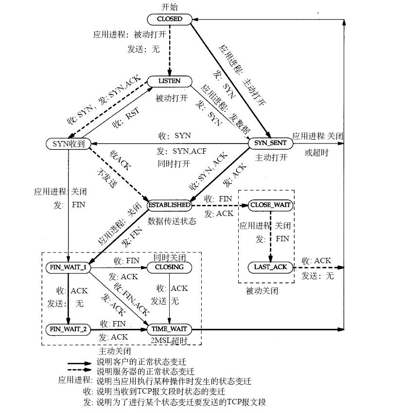

###路由和交换
####1. 了解交换机地址学习过程
1.它收到一个帧的时候，先检查源MAC地址，看看自己维护的一个地址表中有没有这个地址。如果有，则直接进行直接转发；如果没有，则将这个MAC地址、进入的端口、进入的时间放入这个表中；
2.检查目的MAC地址，然后到该表中查找，如果有匹配项，则按照表项中的端口号进行转发；如果没有，则转发到除进口之外的其他所有端口。

####2. 了解 VLAN 的概念和原理
概念：VLAN（Virtual Local Area Network）的中文名为"虚拟局域网"，是一组逻辑上的设备和用户，这些设备和用户并不受物理位置的限制，可以根据功能、部门及应用等因素将它们组织起来，相互之间的通信就好像它们在同一个网段中一样，由此得名虚拟局域网。
原理：

####3. 了解以太网帧格式中的主要字段和 MAC 地址的作用
IP地址可以被不同的主机或终端设备获取，但是MAC地址是硬件地址信息，每一台主机或设备都有自己唯一的MAC地址，它是与该设备的网卡进行绑定的，如果这台设备上的网卡坏掉了，更换网卡后会就会重新获得一个MAC地址（硬件地址）。
无论是局域网还是广域网中的计算机之间的通信，最终表现为将数据包从某种形式的链路上的初始节点出发，从一个节点传递到另外一个节点，最终传送到目的节点。数据包在这些节点之间的移动都是由ARP（Address Resolution Protocol：地址解析协议）负责将IP地址转换成MAC地址上来完成的。IP地址只是其中的一个桥梁的作用，最终到达与客户机相连的路由的时候进行数据传输的时候，是通过MAC地址进行传输的。
####4. IP报文格式的主要字段和 TTL 字段的作用
IP数据报的格式：

主要字段：

- （1）版本：占4位，指IP协议版本。
- （2）首部长度：占4位，可表示的最大十进制数据值是15。这个字段所表示数的单位是32位字（1个32位字长是4字节），因此，当IP的首部长度为1111时（即十进制的15），首部长度就达到最大值60字节。
- （3）区分服务：占8位，用来获得更好的服务。
- （4）总长度：是指首部和数据之和的长度，单位为字节。总长度为16位，因此数据报的最大长度为2^16-1=65535字节。在IP层下面的每种数据链路层都有其自己的帧格式，其中包括帧格式中的数据字段的最大长度，这称为最大传送单元MTU，其默认值为1500字节。
- （5）标识：占16位，IP软件在存储器中维持一个计数器，每产生一个数据报，计数器就加1，并将此值赋给标识字段。但这个”标识“并不是序号，因为IP是无连接服务，数据报不存在按序接收的问题。当数据报由于长度超过网络的MTU而必须分片时，这个标识字段的值就被复制到所有的数据报片的标识字段中。相同的标识字段的值⑩分片后的各数据报片最后能正确地重装成为原来的数据报。
- （6）标志：占3位，但目前只有两位有意义。
- （7）片偏移：占13位，片偏移指出：较长的分组在分片后，某片在原分组中的相对位置。也就是说，相对于用户数据字段的起点，该片从何处开始。片偏移以8个字节为偏移单位。这就是说，每个分片的长度一定是8个字节（64位）的整数倍。
- （8）TTL字段的作用：TTL（time to live），即生存时间，该字段表示一个IP数据报能够经过的最大的路由器跳数，TTL字段是由IP数据报发送端初始设置的，每个处理该数据报的路由器都需要将其 TTL值减1，即当一个IP数据报每经过一个路由时，其TTL值会减1，当路由器收到一个TTL值为0的数据报时，路由器会将其丢弃。因此，TTL字段的目的是就是为了防止1个IP数据报网络中循环的流动。
- （9）协议：占8位，协议字段指出此数据报携带的数据是使用何种协议，以便使目的主机的IP层知道应将数据部分上交给哪个处理过程。

常用的一些协议和相应的协议字段值如下：

- （10）首部检验和：占16位。这个字段只检验数据报的首部，但不包括数据报部分。
- （11）源地址：占32位
- （12）目的地址：占32位

####5. 掌握 IPv4 地址、私有地址、子网掩码,并能够熟练计算
IPv4地址以四段进行划分，每一段以四位二进制数表示，每一位表示的十进制数范围为:0~255
为了方便管理，IP地址可以分为五类：
<pre><code style="color: #000000;">A类：0~127
B类：128~191
C类：192~223
D类：224~239，组播地址
E类：240~254，保留为研究测试使用
</pre></code>
私有IP地址范围： 
<pre><code style="color: #000000;">A: 10.0.0.0~10.255.255.255 即10.0.0.0/8 
B:172.16.0.0~172.31.255.255即172.16.0.0/12 
C:192.168.0.0~192.168.255.255 即192.168.0.0/16
</pre></code>
子网掩码的计算：
- 1.首先，将子网数目从十进制数转换为二进制数；
- 2.接着，如果主机数小于或等于254（注意：去掉保留的两位IP地址），则统计由”1“中得到的二进制数的位数，设为N；如果主机数大于254，则N>8,也就是说主机地址将超过8位；
- 3.最后，使用255.255.255.255将此类IP地址的主机地址位数全部置为1，然后按照”从后向前“的顺序将N位全部置为0，所得到的数值即为所求的子网掩码值。

####6. ARP 协议的原理和基本流程

&nbsp;&nbsp;&nbsp;&nbsp;&nbsp;&nbsp;首先,每台主机都会在自己的ARP缓冲区中建立一个 ARP列表,以表示IP地址和MAC地址的对应关系。当源主机需要将一个数据包要发送到目的主机时，会首先检查自己ARP列表中是否存在该 IP地址对应的MAC地址，如果有，就直接将数据包发送到这个MAC地址;如果没有，就向本地网段发起一个ARP请求的广播包,查询此目的主机对应的MAC地址。此ARP请求数据包里包括源主机的IP地址、硬件地址、以及目的主机的IP地址。网络中所有的主机收到这个ARP请求后，会检查数据包中的目的IP是否和自己的IP地址一致。如果不相同就忽略此数据包;如果相同,该主机首先将发送端的MAC地址和IP地址添加到自己的ARP列表中，如果ARP表中已经存在该IP的信息，则将其覆盖,然后给源主机发送一个ARP响应数据包，告诉对方自己是它需要查找的MAC地址;源主机收到这个ARP响应数据包后,将得到的目的主机的IP地址和MAC地址添加到自己的ARP列表中，并利用此信息开始数据的传输。如果源主机一直没有收到ARP响应数据包,表示ARP查询失败。

####7. DHCP 协议的原理和 DHCP Client 获取地址的基本过程

DHCP协议的原理：客户机从服务器获取IP的四个租约过程，客户机请求ip，服务器相应请求，客户机选择ip，服务器确定租约。

- 1. 客户机请求IP地址 —— DHCP客户机在网络中广播一个DHCP DISCOVER包，请求ip地址 ，DHCP Discover 包的源地址为0.0.0.0 。目的地址为255.255.255.255，该包包含客户机的MAC和计算机名，使服务器能够确定是哪个客户机发送的请求。

- 2. 服务器响应请求——当DHCP服务器接收到客户机请求ip地址的信息时，就在自己的库中查找是否有合法的ip地址提供给客户机，如果有 ，将此ip标记，广播一个 DHCP offer 包。这个包中包含：客户机的的MAC地址；提供的合法ip；子网掩码；租约期限；服务器标示；其他参数等。因为客户机没有ip地址，所以还是以广播方式发送的，源地址：0.0.0.0 目的地255.255.255.255。

- 3. 客户机选择IP地址——DHCP客户机接收到第一个DHCP offer包中选择ip地址，并在次 广播一个DHCP request 包到所有服务器，该包中包含为客户机提供的ip配置的服务器的服务标示符（ip地址），服务器查看标示符，以确定自己提供的ip地址是否被客户机选中，如果客户机接受ip，则发出ip地址的DHCP服务器将该地址保留，就不能将该地址提供给另一个DHCP。如果拒绝，提供给下一个ip租约请求。这个源地址仍然是0.0.0.0 目的地255.255.255.255。

- 4. 服务器确认IP租约——DHCP租约的最后一步，服务器确认租约，发送一个DHCP ack/DHCP NACK包。服务器收到DHCP request包后，以dhcpack包向客户机广播出去，当客户机收到后，就配置了ip地址，完成初始化，就可以在TCP/IP网络上通信了。客户机收到DHCP nack包后会重新发送DHCP discover包。这次源地址是服务器的ip地址目的地是255.255.255.255。

IP的租约更新:当客户机重启和租期到达50%时，就需要更新租约，直接想提供的服务器发送DHCP request包，要求更新租约。客户机无法和服务器取得联系时，继续使用现有IP，一直等到85%时，向所有的服务器发送广播DHCP request 包请求更新，如果仍然无法联系，则客户机将开始新的ip租约过程DHCP discover包

配置DHCP服务的要求：服务器具有静态IP ；在域环境下需要使用活动目录服务授权DHCP服务；建立作用域。（如果在安装时建立则默认为6天，之后创建为8天，无线为2小时）

配置选项有服务器选项、作用域选项、保留选项。服务器选项：对所有作用域生效；作用与选项：对当前作用域生效；保留选项：对当前作用域中某台客户机生效。

####8. 路由表的组成,路由匹配过程,最长匹配原则
- 路由表的组成：
<pre><code style="color: #000000;">Destination：目的逻辑网络或子网地址
Gateway：与之相邻的路由器的端口地址，即该路由的下一跳 IP地址
Genmask：目的逻辑网络或子网的掩码
Flags：路由标志，标记当前网络节点的状态
        标志说明：
        <pre><code style="color: #000000;">U Up表示此路由当前为启动状态。 
        H Host，表示此网关为一主机。 
        G Gateway，表示此网关为一路由器。 
        R Reinstate Route，使用动态路由重新初始化的路由。 
        D Dynamically,此路由是动态性地写入。 
        M Modified，此路由是由路由守护程序或导向器动态修改。 
        ! 表示此路由当前为关闭状态。
        </pre></code>
Metric：跳数，该条路由记录的质量，一般情况下，如果有多条到达相同目的地的路由记录，路由器会采用metric值小的那条路由
Iface：学习到该路由条目的接口，也是数据包离开路由器去往目的地将经过的接口
</pre></code>

- 路由匹配原则：
在路由器中，路由选择的依据包括目的地址、最长匹配、管理距离（Priority）和度量值（Metric）。  
路由选择过程如下： 
<pre><code style="color: #000000;">1） 首先根据目的地址和最长匹配原则进行查找。  
2）若有两条或两条以上路由符合，则查看管理距离，不同路由协议的管理距离值不同。管理距离数值越小，优先级越高。
3）当管理距离相同时，会查看度量值。度量值越小，优先级越高。
</pre></code>
所谓的最长匹配就是路由查找时，使用路由表中到达同一目的地的子网掩码最长的路由。

####9. 了解动态路由协议 OSPF 和 BGP 的基本原理
OSPF的基本原理：

OSPF（OPEN SHORTEST PATH FIRST）开放式最短路径优先，它是一种链路状态路由协议，区别RIP的关键就是它是根据链路的成本来选择最佳路径，这也注定了OSPF是一种复杂的协议。
OSPF始终都是围绕着三张表来进行路由的：邻接表，拓扑表、路由表。我将从这三张表的形成过程来简单阐述下OSPF是如何达到路由功能的。

首先，当路由器开启OSPF后，路由器之间就会相互发送HELLO报文，HELLO报文中包含路由器和链路的相关信息，发送HELLO报文中包含一些路由器和链路的相关信息，发送HELLO报文的目的是为了形成邻居表，然后，路由器之间就会发送LSA（LINK STATE ADVERTISEMENT，链路状态通告），LSA告诉自己的邻居路由器和自己相连的链路的状态，最后，形成网络的拓扑表，其实这个过程是很复杂的，他们经过发LSA，装发LSA，最后形成LSDB（链路状态数据库，即拓扑表），形成拓扑表之后，在经过SPF算法，通过计算LSDB，最后形成路由表。

形成路由表后，路由器就可以根据路由表来转发数据包，但是，这只是理想情况，如果之后，网络拓扑发生了变化，或是网络链路出现了问题，OSPF协议还是会经过这三张表来重新计算新的路由，只不过不会这么复杂了，路由器在默认情况下，10S就会发送一次HELLO报文，以检测链路状态，保证链路始终是正常的。

当然，OSPF不会就这么完了，通过这三张表最后形成路由表只是OSPF的基础。下面我就不得不讲下OSPF的多区域性了。

OSPF协议之所以能够加快链路的收敛和提高链路的计算效率，就是通过多区域实现的，每个OSPF区域都分为一个主干区域0和其他多个相连区域，在一个OSPF区域中，主干区域0是必不可少的，其他的区域都必须通过主干区域连接在一起，也就是说，OSPF区域的结构类似于星型结构，所有的其他区域都连接在主干区域0上面（特殊情况下也可以不连在区域0上面，但是这必须通过虚链路技术让他们间接的连在一起）。说到这里，就有几个概念需要说明下：

- ABR：区域边界路由器，就是连接OSPF各个区域的路由器
- ASBR：自治系统边界路由器，就是连接OSPF协议和其他协议的路由器

BGP 的基本原理：
- 1.多条路径时，BGP Speaker只选最优的给自己使用
- 2.BGP Speaker只把自己的路由通告给邻居
- 3.从EBGP获得的路由会向它所有BGP 邻居通告(EBGP/IBGP)BGP Speaker从IBGP获得的路由不会通告给它的IBGP邻居（BGP 的水平分割）IGP是基于端口的水平分割；而IBGP是基于邻居的水平分割。水平分割的作用是避免产生路由环路。
- 4.BGP Speaker从IBGP获得的路由是否通告给它的EBGP邻居要服从IGP和BGP是否同步来决定
- 5.邻居关系一建立，BGP Speaker就把自己所有的BGP最优路由通告给新的邻居

####10. TCP 和 UDP 协议的主要区别
TCP(传输控制协议)：

- 1)提供IP环境下的数据可靠传输(一台计算机发出的字节流会无差错的发往网络上的其他计算机，而且计算机A接收数据包的时候，也会向计算机B回发数据包，这也会产生部分通信量)，有效流控，全双工操作(数据在两个方向上能同时传递)，多路复用服务，是面向连接，端到端的传输;

- 2)面向连接：正式通信前必须要与对方建立连接。事先为所发送的数据开辟出连接好的通道，然后再进行数据发送，像打电话。

- 3)TCP支持的应用协议：Telnet(远程登录)、FTP(文件传输协议)、SMTP(简单邮件传输协议)。TCP用于传输数据量大，可靠性要求高的应用。

UDP(用户数据报协议，User Data Protocol)

- 1)面向非连接的(正式通信前不必与对方建立连接，不管对方状态就直接发送，像短信，QQ)，不能提供可靠性、流控、差错恢复功能。UDP用于一次只传送少量数据，可靠性要求低、传输经济等应用。

- 2) UDP支持的应用协议：NFS(网络文件系统)、SNMP(简单网络管理系统)、DNS(主域名称系统)、TFTP(通用文件传输协议)等。

主要区别：

TCP：面向连接、传输可靠(保证数据正确性,保证数据顺序)、用于传输大量数据(流模式)、速度慢，建立连接需要开销较多(时间，系统资源)。

UDP：面向非连接、传输不可靠、用于传输少量数据(数据包模式)、速度快。

####11. Linux如何配置 IP 地址、网关和 DNS
在Linux系统上我们配置IP地址和网管如果是临时的可以使用ifconfig这个命令进行配置：
<pre><code style="color: #000000;">ifconfig eth0 192.168.1.110 netmask 255.255.255.0 gw 192.168.1.1   //这样就配置了IP，但是这个IP

以上的配置都是临时的，如果重启网络将被改变。下面是直接写到配置文件中：
centos/redhat系列的网卡配置：
vim /etc/sysconfig/network/ifcfg-eth0
DEVICE="eth0"
BOOTPROTO=static
ONBOOT=yes
IPADDR=192.168.1.110
GATEWAY=192.168.1.1
NETMASK=255.255.255.0
DNS1=192.168.1.1
DNS2=8.8.8.8

debian/ubuntu系列的配置：
vim /etc/network/interfaces
\#开机自动激活eth0接口
auto eth0
\#配置eth0接口为静态设置IP地址
iface eth0 inet static
address 192.168.1.110
netmask 255.255.255.0
network 192.168.1.0
broadcast 192.168.1.255
gateway 192.168.1.1

DNS的配置：
vim /etc/resolv.conf
nameserver 192.168.1.1 
nameserver 8.8.8.8
nameserver 8.8.4.4
</pre></code>

####12. Linux如何添加静态路由,并了解Linux策略路由
linux下静态路由修改命令
<pre><code style="color: #000000;">方法一：
添加路由
route add -net 192.168.0.0/24 gw 192.168.0.1
route add -host 192.168.1.1 dev 192.168.0.1
删除路由
route del -net 192.168.0.0/24 gw 192.168.0.1

add 增加路由
del 删除路由
-net 设置到某个网段的路由
-host 设置到某台主机的路由
gw 出口网关 IP地址
dev 出口网关 物理设备名

增加默认路由
route add default gw 192.168.0.1
默认路由一条就够了

route -n 查看路由表

方法二：
添加路由
ip route add 192.168.0.0/24 via 192.168.0.1
ip route add 192.168.1.1 dev 192.168.0.1
删除路由
ip route del 192.168.0.0/24 via 192.168.0.1

add 增加路由
del 删除路由
via 网关出口 IP地址
dev 网关出口 物理设备名

增加默认路由
ip route add default via 192.168.0.1 dev eth0
via 192.168.0.1 是我的默认路由器

查看路由信息
ip route

保存路由设置，使其在网络重启后任然有效

在centos/redhat下，我们在/etc/sysconfig/network-script/目录下创建名为route- eth0的文件 
vim /etc/sysconfig/network-script/route-eth0 
在此文件添加如下格式的内容：
192.168.1.0/24 via 192.168.0.1 
然后重启网络进行验证

在debian/ubuntu下，我们直接在网卡配置文件里面进行写入：
auto eth0
iface eth0 inet static
address 192.168.1.2
netmask 255.255.255.0
gateway 192.168.1.254
up route add -net 192.168.2.0 netmask 255.255.255.0 gateway 192.168.2.1 dev eth0
down route del -net 192.168.2.0 netmask 255.255.255.0 gateway 192.168.2.1 dev eth0
这样在eth0激活的时候添加一条静态路由，路由目的为网络192.168.2.0/24，网关为192.168.2.1，该条路由使用eth0接口，当接口eth0关闭时删除该条静态路由。
</pre></code>

Linux策略路由：
策略路由是指对于IP包的路由是以网络管理员根据需要定下的一些策略为主要依据进行路由的。例如我们可以有这样的策略：“所有来自网A的包，选择X路径；其他选择Y路径”，或者是“所有TOS为A的包选择路径F；其他选择路径K”。

####13. 了解 QoS ,DSCP 和 SLA 的基本概念
- QoS(Quality of Service,服务质量)指一个网络能够利用各种基础技术，为指定的网络通信提供更好的服务能力, 是网络的一种安全机制， 是用来解决网络延迟和阻塞等问题的一种技术。在正常情况下，如果网络只用于特定的无时间限制的应用系统，并不需要QoS，比如Web应用，或E-mail设置等。但是对关键应用和多媒体应用就十分必要。当网络过载或拥塞时，QoS 能确保重要业务量不受延迟或丢弃，同时保证网络的高效运行。在RFC 3644上有对QoS的说明。
- DSCP差分服务代码点（Differentiated Services Code Point）
它在每个数据包IP头部的服务类别TOS标识字节中，利用已使用的6比特和未使用的2比特，通过编码值来区分优先级。
- SLA：Service-Level Agreement的缩写
是关于网络服务供应商和客户间的一份合同，其中定义了服务类型、服务质量和客户付款等术语。

####14. 了解 Data Center 网络的基本拓扑以及特性

####15. 了解 CDN 的基本概念

&nbsp;&nbsp;&nbsp;&nbsp;&nbsp;&nbsp;CDN的全称是Content Delivery Network，即内容分发网络。其基本思路是尽可能避开互联网上有可能影响数据传输速度和稳定性的瓶颈和环节，使内容传输的更快、更稳定。通过在网络各处放置节点服务器所构成的在现有的互联网基础之上的一层智能虚拟网络，CDN系统能够实时地根据网络流量和各节点的连接、负载状况以及到用户的距离和响应时间等综合信息将用户的请求重新导向离用户最近的服务节点上。其目的是使用户可就近取得所需内容，解决 Internet网络拥挤的状况，提高用户访问网站的响应速度。

&nbsp;&nbsp;&nbsp;&nbsp;&nbsp;&nbsp;CDN是构建在网络之上的内容分发网络，依靠部署在各地的边缘服务器，通过中心平台的负载均衡、内容分发、调度等功能模块，使用户就近获取所需内容，降低网络拥塞，提高用户访问响应速度和命中率。CDN的关键技术主要有内容存储和分发技术。

&nbsp;&nbsp;&nbsp;&nbsp;&nbsp;&nbsp;CDN的基本原理是广泛采用各种缓存服务器，将这些缓存服务器分布到用户访问相对集中的地区或网络中，在用户访问网站时，利用全局负载技术将用户的访问指向距离最近的工作正常的缓存服务器上，由缓存服务器直接响应用户请求。

关键技术：

- （1）内容发布：它借助于建立索引、缓存、流分裂、组播（Multicast）等技术，将内容发布或投递到距离用户最近的远程服务点（POP）处；
- （2）内容路由：它是整体性的网络负载均衡技术，通过内容路由器中的重定向（DNS）机制，在多个远程POP上均衡用户的请求，以使用户请求得到最近内容源的响应；
- （3）内容交换：它根据内容的可用性、服务器的可用性以及用户的背景，在POP的缓存服务器上，利用应用层交换、流分裂、重定向（ICP、WCCP）等技术，智能地平衡负载流量；
- （4）性能管理：它通过内部和外部监控系统，获取网络部件的状况信息，测量内容发布的端到端性能（如包丢失、延时、平均带宽、启动时间、帧速率等），保证网络处于最佳的运行状态。
主要特点：
- 1、本地Cache加速 提高了企业站点(尤其含有大量图片和静态页面站点)的访问速度，并大大提高以上性质站点的稳定性
- 2、镜像服务 消除了不同运营商之间互联的瓶颈造成的影响，实现了跨运营商的网络加速，保证不同网络中的用户都能得到良好的访问质量。
- 3、远程加速 远程访问用户根据DNS负载均衡技术智能自动选择Cache服务器，选择最快的Cache服务器，加快远程访问的速度
- 4、带宽优化 自动生成服务器的远程Mirror（镜像）cache服务器，远程用户访问时从cache服务器上读取数据，减少远程访问的带宽、分担网络流量、减轻原站点WEB服务器负载等功能。
- 5、集群抗攻击 广泛分布的CDN节点加上节点之间的智能冗余机制，可以有效地预防黑客入侵以及降低各种D.DoS攻击对网站的影响，同时保证较好的服务质量 。
产品优势:

&nbsp;&nbsp;&nbsp;&nbsp;&nbsp;&nbsp;CDN能几乎涵盖国内所有线路。而在可靠性上， CDN 在结构上实现了多点的冗余，即使某一个节点由于意外发生故障，对网站的访问能够被自动导向其他的健康节点进行响应。CDN能轻松实现网站的全国铺设，不必考虑服务器的投入与托管、不必考虑新增带宽的成本、不必考虑多台服务器的镜像同步、不必考虑更多的管理维护技术人员。

####16. 了解 SDN,NFV,Openflow,IoT 或者 CDN s Routing 的概念和应用场景。
(或者其他网络方面的新进展)
CDN的应用场景（百度百科中了解）：
- 1）站点或者应用中大量静态资源的加速分发，建议将站点内容进行动静分离，动态文件可以结合云服务器ECS，静态资源如各类型图片、html、css、js文件等，建议结合 对象存储OSS存储海量静态资源，可以有效加速内容加载速度，轻松搞定网站图片、短视频等内容分发。
- 2）支持各类文件的下载、分发，支持在线点播加速业务，如mp4、flv视频文件或者平均单个文件大小在20M以上，主要的业务场景是视音频点播、大文件下载（如安装包下载）等，建议搭配对象存储OSS使用，可提升回源速度，节约近2/3回源带宽成本。
- 3）视频流媒体直播服务，支持媒资存储、切片转码、访问鉴权、内容分发加速一体化解决方案。结合弹性伸缩服务，及时调整服务器带宽，应对突发访问流量；结合媒体转码服务，享受高速稳定的并行转码，且任务规模无缝扩展。目前CDN直播加速已服务内部用户测试并优化，即将上线，敬请期待
- 4）移动APP更新文件（apk文件）分发，移动APP内图片、页面、短视频、UGC等内容的优化加速分发。提供httpDNS服务，避免DNS劫持并获得实时精确的DNS解析结果，有效缩短用户访问时间，提升用户体验。

Anycast（百度百科中了解）：

&nbsp;&nbsp;&nbsp;&nbsp;&nbsp;&nbsp;Anycast最初是在RFC1546中提出并定义的，它的最初语义是，在IP网络上通过一个Anycast地址标识一组提供特定服务的主机，同时服务访问方并不关心提供服务的具体是哪一台主机（比如DNS或者镜像服务），访问该地址的报文可以被IP网络路由到这一组目标中的任何一台主机上，它提供的是一种无状态的、尽力而为的服务。目前对于Anycast的中文译称主要有，“任播”、“泛播”、“选播”等，本文一律使用“任播”一词，或者直接使用英文单词“Anycast”。

&nbsp;&nbsp;&nbsp;&nbsp;&nbsp;&nbsp;Anycast 指IPV6协议中一个发送方同最近的一组接收方之间的通信。Anycast 的定义是: 当一个单播地址被分配到多于一个的接口上时，发到该接口的报文被网络路由到由路由协议度量的“最近”的目标接口上。 Anycast 允许源结点向一组目标结点中的一个结点发送数据报，而这个结点由路由系统选择，对源结点透明；同时，路由系统选择“最近”的结点为源结点提供服务，从而在一定程度上为源结点提供了更好的服务也减轻了网络负载。正是Anycast 这一通信模式的特点，使它在IP网络中具有了应用前景。首先，分布的服务共享相同的IP地址，同时在IP层进行透明的服务定位，这使得各种网络服务特别是应用层服务具有更强的透明性，比如DNS（Domain Name System，域名系统），在IPv6网络中它可以共享一个熟知的IP地址，用户不需要特殊配置也不用关心访问的是哪一台DNS服务器；其次，路由系统选择了“最近”的服务，缩短了服务响应的时间，同时减轻了网络负载；最后，相同的服务在网络上冗余分布，路由系统可以提供机制选择负载相对轻的带宽相对高的路径来转发报文，这样就给用户带来了两个方面的好处：

- 1) 减弱了分布式拒绝服务攻击(DDoS:Distributed Denial of Service)对用户带来的影响。当 Anycast 组中某一个成员或者几个成员受到攻击时，负责报文转发的路由器可以根据各个组成员的响应时间来决定报文应该转发到哪个成员上，这样受到攻击的成员由于没有响应，所以报文就不会被转发到那里，同时，由于 Anycast 提供的服务访问透明性，组成员也相对较难受到DDoS攻击。
- 2) 减弱了网络拥塞给用户带来的影响。同上面的道理，当 Anycast 的某些组成员处在拥塞的网段时，它的响应时间就较长，报文可以被转发到响应较好的成员那里。

SDN：

&nbsp;&nbsp;&nbsp;&nbsp;&nbsp;&nbsp;软件定义网络（Software Defined Network, SDN ），是Emulex网络一种新型网络创新架构，是网络虚拟化的一种实现方式，其核心技术OpenFlow通过将网络设备控制面与数据面分离开来，从而实现了网络流量的灵活控制，使网络作为管道变得更加智能。

NFV：

&nbsp;&nbsp;&nbsp;&nbsp;&nbsp;&nbsp;NFV，即网络功能虚拟化，Network Function Virtualization。通过使用x86等通用性硬件以及虚拟化技术，来承载很多功能的软件处理。从而降低网络昂贵的设备成本。可以通过软硬件解耦及功能抽象，使网络设备功能不再依赖于专用硬件，资源可以充分灵活共享，实现新业务的快速开发和部署，并基于实际业务需求进行自动部署、弹性伸缩、故障隔离和自愈等。

OpenFlow：

&nbsp;&nbsp;&nbsp;&nbsp;&nbsp;&nbsp;随着互联网的发展，今天的互联网业务对互联网提出了越来越高的传输质量要求，如何修改互联网以满足新业务的需求，出现了改良派和改革派两种不同的做法。改良派认为可以在原有的基础设施上添加新的协议来解决问题，改革派则认为必须推倒一切重来。改革派提出这样的两个问题：“就目前掌握的知识，如果我从一个全新的开始设计互联网，我会怎么做”和“15年后的互联网应该是什么样子”。为此，改革派们开始了一系列新的设计方案，OpenFlow就是改革派提出的一种新型网络交换模型，与此相应的，他们还成立了OpenFlow交换机论坛(The OpenFlow Switch Consortium，后文简称OpenFlow论坛)。

IOT （物联网）：

&nbsp;&nbsp;&nbsp;&nbsp;&nbsp;&nbsp;“物联网”(Internet Of Things)指的是将各种信息传感设备，如射频识别装置、红外感应器、全球定位系统、激光扫描器等种种装置与互联网结合起来而形成的一个巨大网络。其目的是让所有的物品都与网络连接在一起，方便识别和管理。

###NAT的原理及应用
####1. NAT的基本原理

NAT网络地址转换(NAT,Network Address Translation)属接入广域网(WAN)技术,是一种将私有(保留)地址转化为合法IP地址的转换技术,它被广泛应用于各种类型Internet接入方式和各种类型的网络中。原因很简单，NAT不仅完美地解决了lP地址不足的问题，而且还能够有效地避免来自网络外部的攻击，隐藏并保护网络内部的计算机。

&nbsp;&nbsp;&nbsp;&nbsp;&nbsp;&nbsp;NAT服务器的计算机有两个网卡：一个和内网相连，此网卡IP是私址类型；另外一个和外网（Internet）相连，此网卡IP是公址类型。他把局域网和外网联系起来，并完成内外网地址（IP+端口）的映射工作。

应用场景：
在公司内部当我们的公网ip地址不够用的时候，我们内部不同的主机还需要通过同一个网络进行上网，我们就可以使用NAT进行地址转换。

####2. Linux支持的NAT类型
Linux系统上我们常常看到支持的NAT的类型为：SNAT（源网络地址转换）和DNAT（目的网络地址转换）两种类型。

####3. NAT对TCP、UDP、SSL、HTTP等各种应用和协议的影响
校验和与NAT的不兼容：

- TCP/UDP校验和的计算包含消息的伪首部。结果就是，接受方接收到经过NAT转换的消息，将导致校验和计算失败。
- IPSec受NAT影响较严重，而SSL可穿过NAT而毫无影响。
- 如果协议数据报文中不包含地址信息，则很容易利用传统的NAT技术来完成透明的地址转换功能，通常我们使用的如下应用就可以直接利用传统的NAT技术：HTTP、TELNET、FINGER、NTP、NFS、ARCHIE、RLOGIN、RSH、RCP等。

主要查看:<a href="http://baike.baidu.com/link?url=pffIzIHSFurO-YwW4iq1CgDffW1zV5e9DOLhYSOV5Q6pPTZL88y7tjbaFhKbMie4TGJZ2ZOf2OSo3eABaH7B0_" title="Title">nat百度百科的知识</a>

####4. Linux中如何配置NAT
- PREROUTING是路由前匹配的链，PREROUTING一般用于做目的地址转换(DNAT):
把访问202.103.96.112的访问转发到192.168.0.112

<pre><code style="color: #000000;">iptables -t nat -A PREROUTING -d 202.103.96.112 -j DNAT --to-destination 192.168.0.112
</pre></code>
POSTROUTING是路由后匹配的链，POSTROUTING一般用于做源地址转换（SNAT）
流出本机的数据的source ip address修改成58.20.51.66
<pre><code style="color: #000000;">iptables -t nat -A POSTROUTING -s 192.168.0.112 -j SNAT --to-source 58.20.51.66

允许IP转发
echo "1" > /proc/sys/net/ipv4/ip_forward
</pre></code>
####5. 向老员工了解公司哪些业务使用了NAT
- NAT主要使用在公司内部一些web平台，在同一个服务器上部署多个应用的时候需要让外部进行访问的时候，则需要使用到NAT模式进行转发。
- 使用NAT也会有一些问题，比如公司在某台双网卡的云主机上部署了FTP服务，但是这里并没有指定ip，有时候如果返回数据的时候走的是NAT，那么数据将无法通过公网顺利返回给客户，这里的解决办法就是在ftp服务器中配置指定的ip，让它在返回数据的时候走这个线路。

###常见网络调试命令
####1. ping命令的原理、用法、IPv6变种等

&nbsp;&nbsp;&nbsp;&nbsp;&nbsp;&nbsp;&nbsp;PING(Packet Internet Groper)，因特网包探索器，用于测试网络连接量的程序。Ping发送一个ICMP(Internet Control Messages Protocol)即因特网信报控制协议；回声请求消息给目的地并报告是否收到所希望的ICMP echo(ICMP回声应答)。它是用来检查网络是否通畅或者网络连接速度的命令。作为一个生活在网络上的管理员或者黑客来说，ping命令是第一个必须掌握的DOS命令，它所利用的原理是这样的：利用网络上机器IP地址的唯一性，给目标IP地址发送一个数据包，再要求对方返回一个同样大小的数据包来确定两台网络机器是否连接相通，时延是多少。

<pre><code style="color: #000000;">ping [ -LRUbdfnqrvR ] [ -c count ] [ -i wait ] [ -l preload ] [ -p pattern ] [ -s packetsize ]

参数
-c
    count 在发送(和接收)了正好数量为 count 的回显应答分组后停止操作。在发送了 count 个分组后没有收到任何分组的特别情况是发送导致了终止(选程主机或网关不可达)。
-d      
    在所用的套接字上使用SO_DEBUG 选项。
-f      
    以高速方式来作ping 。以分组返回的速度来输出其它分组或每秒输出百次。当收到每个回显应答并打印一个退格符时，对每个回显请求都打印一个句点``.。这可以快速显示出丢弃了多少个分组，只有超级用户可以用这个选项。这（操作）对网络要求非常苛刻，应该慎重使用。
-i
    wait 在发送每个分组时等待 wait 个秒数。缺省值为每个分组等待一秒。此选项与-f选项不能同时使用。
-l
    preload 如果指定 preload ，那么 ping 程序在开始正常运行模式前尽可能快地发送分组。同样只有超级用户可以用这个选项。
-n      
    只以数字形式输出信息。这样就不尝试去查找主机名了。
-p
    pattern 可以指定最多16个填充字节用于保持分组长度为16的整数倍。在网络上诊断与数据相关问题时此选项很有用。例如``-p ff将使发出的分组都用全1填充数据区。
-q      
    静态输出。在程序启动和结束时只显示摘要行。
-R      
    记录路由。在回显请求分组中包含记录路由选项并在相应的分组返回时显示路由缓冲区。注意IP首部的容量只能存放9条这样的路由。很多主机忽略或禁用此选项。
-r      
    在所连接的网络上旁路正常的选路表，直接向主机发送分组。如果主机未处于直接相连的网络上，那么返回一个错误。此选项可用来通过无路由接口对一台主机进行检测(例如当接口已被routed 程序丢弃后)。
-s
    packetsize 指定要发送数据的字节量。缺省值为 56 ，这正好在添加了 8 字节的 ICMP 首部后组装成 64 字节的 ICMP 数据报。
-v      
    详细模式输出。打印接收到的回显应答以外的ICMP分组。
-w
    waitsecs 在 waitsecs 秒后停止 ping 程序的执行。当试图检测不可达主机时此选项很有用。
</pre></code>

&nbsp;&nbsp;&nbsp;&nbsp;&nbsp;&nbsp;当用ping来隔离故障时，应首先在本地主机上运行，以检查本地网络接口有效运行。然后，应该进一步检查主机和网关。计算出往返时间和分组丢失率。如果收到重复的分组，虽然这些分组的往返时间要用于计算往返时间的最小/平均 /最大值，但是它们不应该算在刚才计算的丢失的分组中。当指定数量的分组已 经发送(和接收)时或如果程序被SIGINT信号终止，会显示一份简短的摘要。

&nbps;&nbps;&nbps;&nbps;&nbps;&nbps;如果ping程序根本没有收到任何返回分组，那它将以返回码1退出。出错时返回2。否则返回0。这些值可能用于查看主机存在与否。此程序专用于网络测试，度量和管理。因为它会使用网络的流量，在正常操作或自动的脚本中使用它并不明智。

下面一些简单的例子：
<pre><code style="color: #000000;">每隔0.5秒ping一次www.baidu.com，总共ping 5次。
hy@Aaron:~$ ping -c 5 -i 0.5 www.baidu.com
PING www.a.shifen.com (119.75.217.109) 56(84) bytes of data.
64 bytes from 119.75.217.109: icmp_seq=1 ttl=53 time=22.5 ms
64 bytes from 119.75.217.109: icmp_seq=2 ttl=53 time=22.4 ms
64 bytes from 119.75.217.109: icmp_seq=3 ttl=53 time=24.1 ms
64 bytes from 119.75.217.109: icmp_seq=4 ttl=53 time=22.4 ms
64 bytes from 119.75.217.109: icmp_seq=5 ttl=53 time=23.0 ms

--- www.a.shifen.com ping statistics ---
5 packets transmitted, 5 received, 0% packet loss, time 2003ms
rtt min/avg/max/mdev = 22.421/22.919/24.109/0.639 ms
-i指定发送数据包时间间隔,-c指定一共发送多少个数据包,-I指定源地址,-q指定直接显示程序的启动和最后结果
hy@Aaron:~$ ping -i 0.2 -c 30 -I 10.245.34.136 8.8.8.8 -q
PING 8.8.8.8 (8.8.8.8) from 10.245.34.136 : 56(84) bytes of data.

--- 8.8.8.8 ping statistics ---
30 packets transmitted, 8 received, 73% packet loss, time 5966ms
rtt min/avg/max/mdev = 101.688/115.272/144.259/12.603 ms
</pre></code>
这里我们可以使用ping6来识别IPv6地址

####2.traceroute命令的原理、用法、IPv6变种等

程序利用增加存活时间（TTL）值来实现其功能的。每当数据包经过一个路由器，其存活时间就会减1。当其存活时间是0时，主机便取消数据包，并传送一个ICMP TTL数据包给原数据包的发出者。

程序发出的首3个数据包TTL值是1，之后3个是2，如此类推，它便得到一连串数据包路径。注意IP不保证每个数据包走的路径都一样。

参数说明：

traceroute指令让你追踪网络数据包的路由途径，预设数据包大小是40Bytes。

<pre><code style="color: #000000;">  -d   使用Socket层级的排错功能。
  -f\<存活数值\>   设置第一个检测数据包的存活数值TTL的大小。
  -F   设置勿离断位。
  -g\<网关\>   设置来源路由网关，最多可设置8个。
  -i\<网络界面\>   使用指定的网络界面送出数据包。
  -I   使用ICMP回应取代UDP资料信息。
  -m\<存活数值\>   设置检测数据包的最大存活数值TTL的大小。
  -n   直接使用IP地址而非主机名称。
  -p\<通信端口\>   设置UDP传输协议的通信端口。
  -q\<nqueries\>   设置每一跳的探测包数量。默认是3 。
  -r   忽略普通的Routing Table，直接将数据包送到远端主机上。
  -s\<来源地址\>   设置本地主机送出数据包的IP地址。
  -t\<服务类型\>   设置检测数据包的TOS数值。
  -v   详细显示指令的执行过程。
  -w\<超时秒数\>   设置等待远端主机回报的时间。
  -x   开启或关闭数据包的正确性检验。
  -4, -6 显示地指定使用IPv4或IPv6 traceroute。默认情况下，traceroute会解析给定的主机名，并自动选择合适的协议。如果解析主机名既得到了IPv4的地址，又得到了IPv6的地址，traceroute会使用IPv4。要追踪IPv6地址也可以使用traceroute6.
</pre></code>
例子：
<pre><code style="color: #000000;">traceroute baidu.com         #最常用的方法
traceroute -m 10 baidu.com   #把跳数设置为10次；
traceroute -n baidu.com      #显示IP地址，不查主机名
traceroute -p 6888 baidu.com #探测包使用的基本UDP端口设置6888
traceroute -q 4 baidu.com    #把探测包的个数设置为值4
traceroute -r baidu.com      #绕过正常的路由表，直接发送到网络相连的主机
traceroute -w 3 baidu.com    #把对外发探测包的等待响应时间设置为3秒
</pre></code>
####3. mtr命令的原理、用法等

- 1.Mtr介绍：
Mtr是 Linux中有一个非常棒的网络连通性判断工具，它结合了ping, traceroute,nslookup 的相关特性。
安装mtr工具：
<pre><code style="color: #000000;">apt-get install mtr -y
</pre></code>

- 2.Mtr的相关参数：
<pre><code style="color: #000000;">mtr -s
    用来指定ping数据包的大小
mtr -nno-dns
    不对IP地址做域名解析
mtr -a
    来设置发送数据包的IP地址 这个对一个主机由多个IP地址是有用的
mtr -i
    使用这个参数来设置ICMP返回之间的要求默认是1秒
mtr -4
    IPv4
mtr -6
    IPv6
</pre></code>

- 3.Mtr的输出详解：
mtr 8.8.8.8

以上报告示例说明：
<pre><code style="color: #000000;">第一列:显示的是IP地址和本机域名，这点和traceroute很像
第二列:是显示的每个对应IP的丢包率
第三列:snt:10 设置每秒发送数据包的数量，默认值是10 可以通过参数 -c来指定。其中-c的说明是：–report-cycles COUNT
第四列:显示的最近一次的返回时延
第五列:是平均值 这个应该是发送ping包的平均时延
第六列:是最好或者说时延最短的
第七列:是最差或者说时延最常的
第八列:是标准偏差
</pre></code>

####4.了解dig命令的原理、用法,/etc/resolv.conf的作用

dig（域信息搜索器）命令是一个用于询问DNS域名服务器的灵活的工具。它执行 DNS搜索，显示从受请求的域名服务器返回的答复。多数DNS管理员利用 dig 作为 DNS问题的故障诊断，因为它灵活性好、易用、输出清晰。虽然通常情况下 dig使用命令行参数，但它也可以按批处理模式从文件读取搜索请求。不同于早期版本，dig 的 BIND9 实现允许从命令行发出多个查询。/etc/resolv.conf文件是用来配置相应的DNS服务器的地址，除非被告知请求特定域名服务器，dig 将尝试 /etc/resolv.conf 中列举的所有服务器。当未指定任何命令行参数或选项时，dig 将对“.”（根）执行 NS 查询。

####5. 简述tcpdump命令用法,向老员工了解抓包经验
<pre><code style="color: #000000;">tcpdump - 转储网络上的数据流

-A  以ASCII码方式显示每一个数据包(不会显示数据包中链路层头部信息). 在抓取包含网页数据的数据包时, 可方便查看数据(nt: 即Handy for capturing web pages).

-c  count
    tcpdump将在接受到count个数据包后退出.

-C  file-size (nt: 此选项用于配合-w file 选项使用)
    该选项使得tcpdump 在把原始数据包直接保存到文件中之前, 检查此文件大小是否超过file-size. 如果超过了, 将关闭此文件,另创一个文件继续用于原始数据包的记录. 新创建的文件名与-w 选项指定的文件名一致, 但文件名后多了一个数字.该数字会从1开始随着新创建文件的增多而增加. file-size的单位是百万字节(nt: 这里指1,000,000个字节,并非1,048,576个字节, 后者是以1024字节为1k, 1024k字节为1M计算所得, 即1M=1024 ＊ 1024 ＝ 1,048,576)

-d  以容易阅读的形式,在标准输出上打印出编排过的包匹配码, 随后tcpdump停止.(nt | rt: human readable, 容易阅读的,通常是指以ascii码来打印一些信息. compiled, 编排过的. packet-matching code, 包匹配码,含义未知, 需补充)

-dd 以C语言的形式打印出包匹配码.

-ddd 以十进制数的形式打印出包匹配码(会在包匹配码之前有一个附加的'count'前缀).

-D  打印系统中所有tcpdump可以在其上进行抓包的网络接口. 每一个接口会打印出数字编号, 相应的接口名字, 以及可能的一个网络接口描述. 其中网络接口名字和数字编号可以用在tcpdump 的-i flag 选项(nt: 把名字或数字代替flag), 来指定要在其上抓包的网络接口.

    此选项在不支持接口列表命令的系统上很有用(nt: 比如, Windows 系统, 或缺乏 ifconfig -a 的UNIX系统); 接口的数字编号在windows 2000 或其后的系统中很有用, 因为这些系统上的接口名字比较复杂, 而不易使用.

    如果tcpdump编译时所依赖的libpcap库太老,-D 选项不会被支持, 因为其中缺乏 pcap_findalldevs()函数.

-e  每行的打印输出中将包括数据包的数据链路层头部信息

-E  spi@ipaddr algo:secret,...

    可通过spi@ipaddr algo:secret 来解密IPsec ESP包(nt | rt:IPsec Encapsulating Security Payload,IPsec 封装安全负载, IPsec可理解为, 一整套对ip数据包的加密协议, ESP 为整个IP 数据包或其中上层协议部分被加密后的数据,前者的工作模式称为隧道模式; 后者的工作模式称为传输模式 . 工作原理, 另需补充).

    需要注意的是, 在终端启动tcpdump 时, 可以为IPv4 ESP packets 设置密钥(secret）.

    可用于加密的算法包括des-cbc, 3des-cbc, blowfish-cbc, rc3-cbc, cast128-cbc, 或者没有(none).默认的是des-cbc(nt: des, Data Encryption Standard, 数据加密标准, 加密算法未知, 另需补充).secret 为用于ESP 的密钥, 使用ASCII 字符串方式表达. 如果以 0x 开头, 该密钥将以16进制方式读入.

    该选项中ESP 的定义遵循RFC2406, 而不是 RFC1827. 并且, 此选项只是用来调试的, 不推荐以真实密钥(secret)来使用该选项, 因为这样不安全: 在命令行中输入的secret 可以被其他人通过ps 等命令查看到.

    除了以上的语法格式(nt: 指spi@ipaddr algo:secret), 还可以在后面添加一个语法输入文件名字供tcpdump 使用(nt：即把spi@ipaddr algo:secret,... 中...换成一个语法文件名). 此文件在接受到第一个ESP　包时会打开此文件, 所以最好此时把赋予tcpdump 的一些特权取消(nt: 可理解为, 这样防范之后, 当该文件为恶意编写时,不至于造成过大损害).

-f  显示外部的IPv4 地址时(nt: foreign IPv4 addresses, 可理解为, 非本机ip地址), 采用数字方式而不是名字.(此选项是用来对付Sun公司的NIS服务器的缺陷(nt: NIS, 网络信息服务, tcpdump 显示外部地址的名字时会用到她提供的名称服务): 此NIS服务器在查询非本地地址名字时,常常会陷入无尽的查询循环).

    由于对外部(foreign)IPv4地址的测试需要用到本地网络接口(nt: tcpdump 抓包时用到的接口)及其IPv4 地址和网络掩码. 如果此地址或网络掩码不可用, 或者此接口根本就没有设置相应网络地址和网络掩码(nt: linux 下的 'any' 网络接口就不需要设置地址和掩码, 不过此'any'接口可以收到系统中所有接口的数据包), 该选项不能正常工作.

-F  file
    使用file 文件作为过滤条件表达式的输入, 此时命令行上的输入将被忽略.

-i  interface

    指定tcpdump 需要监听的接口.  如果没有指定, tcpdump 会从系统接口列表中搜寻编号最小的已配置好的接口(不包括 loopback 接口).一但找到第一个符合条件的接口, 搜寻马上结束.

    在采用2.2版本或之后版本内核的Linux 操作系统上, 'any' 这个虚拟网络接口可被用来接收所有网络接口上的数据包(nt: 这会包括目的是该网络接口的, 也包括目的不是该网络接口的). 需要注意的是如果真实网络接口不能工作在'混杂'模式(promiscuous)下,则无法在'any'这个虚拟的网络接口上抓取其数据包.

    如果 -D 标志被指定, tcpdump会打印系统中的接口编号，而该编号就可用于此处的interface 参数.

-l  对标准输出进行行缓冲(nt: 使标准输出设备遇到一个换行符就马上把这行的内容打印出来).在需要同时观察抓包打印以及保存抓包记录的时候很有用. 比如, 可通过以下命令组合来达到此目的:
    ``tcpdump  -l  |  tee dat'' 或者 ``tcpdump  -l   > dat  &  tail  -f  dat''.(nt: 前者使用tee来把tcpdump 的输出同时放到文件dat和标准输出中, 而后者通过重定向操作'>', 把tcpdump的输出放到dat 文件中, 同时通过tail把dat文件中的内容放到标准输出中)

-L  列出指定网络接口所支持的数据链路层的类型后退出.(nt: 指定接口通过-i 来指定)

-m  module
    通过module 指定的file 装载SMI MIB 模块(nt: SMI，Structure of Management Information, 管理信息结构MIB, Management Information Base, 管理信息库. 可理解为, 这两者用于SNMP(Simple Network Management Protoco)协议数据包的抓取. 具体SNMP 的工作原理未知, 另需补充).

    此选项可多次使用, 从而为tcpdump 装载不同的MIB 模块.

-M  secret  如果TCP 数据包(TCP segments)有TCP-MD5选项(在RFC 2385有相关描述), 则为其摘要的验证指定一个公共的密钥secret.

-n  不对地址(比如, 主机地址, 端口号)进行数字表示到名字表示的转换.

-N  不打印出host 的域名部分. 比如, 如果设置了此选现, tcpdump 将会打印'nic' 而不是 'nic.ddn.mil'.

-O  不启用进行包匹配时所用的优化代码. 当怀疑某些bug是由优化代码引起的, 此选项将很有用.

-p  一般情况下, 把网络接口设置为非'混杂'模式. 但必须注意 , 在特殊情况下此网络接口还是会以'混杂'模式来工作； 从而, '-p' 的设与不设, 不能当做以下选现的代名词:'ether host {local-hw-add}' 或  'ether broadcast'(nt: 前者表示只匹配以太网地址为host 的包, 后者表示匹配以太网地址为广播地址的数据包).

-q  快速(也许用'安静'更好?)打印输出. 即打印很少的协议相关信息, 从而输出行都比较简短.

-R  设定tcpdump 对 ESP/AH 数据包的解析按照 RFC1825而不是RFC1829(nt: AH, 认证头, ESP， 安全负载封装, 这两者会用在IP包的安全传输机制中). 如果此选项被设置, tcpdump 将不会打印出'禁止中继'域(nt: relay prevention field). 另外,由于ESP/AH规范中没有规定ESP/AH数据包必须拥有协议版本号域,所以tcpdump不能从收到的ESP/AH数据包中推导出协议版本号.

-r  file
    从文件file 中读取包数据. 如果file 字段为 '-' 符号, 则tcpdump 会从标准输入中读取包数据.

-S  打印TCP 数据包的顺序号时, 使用绝对的顺序号, 而不是相对的顺序号.(nt: 相对顺序号可理解为, 相对第一个TCP 包顺序号的差距,比如, 接受方收到第一个数据包的绝对顺序号为232323, 对于后来接收到的第2个,第3个数据包, tcpdump会打印其序列号为1, 2分别表示与第一个数据包的差距为1 和 2. 而如果此时-S 选项被设置, 对于后来接收到的第2个, 第3个数据包会打印出其绝对顺序号:232324, 232325).

-s  snaplen
    设置tcpdump的数据包抓取长度为snaplen, 如果不设置默认将会是68字节(而支持网络接口分接头(nt: NIT, 上文已有描述,可搜索'网络接口分接头'关键字找到那里)的SunOS系列操作系统中默认的也是最小值是96).68字节对于IP, ICMP(nt: Internet Control Message Protocol,因特网控制报文协议), TCP 以及 UDP 协议的报文已足够, 但对于名称服务(nt: 可理解为dns, nis等服务), NFS服务相关的数据包会产生包截短. 如果产生包截短这种情况, tcpdump的相应打印输出行中会出现''[|proto]''的标志（proto 实际会显示为被截短的数据包的相关协议层次). 需要注意的是, 采用长的抓取长度(nt: snaplen比较大), 会增加包的处理时间, 并且会减少tcpdump 可缓存的数据包的数量， 从而会导致数据包的丢失. 所以, 在能抓取我们想要的包的前提下, 抓取长度越小越好.把snaplen 设置为0 意味着让tcpdump自动选择合适的长度来抓取数据包.

-T  type
    强制tcpdump按type指定的协议所描述的包结构来分析收到的数据包.  目前已知的type 可取的协议为:
    aodv (Ad-hoc On-demand Distance Vector protocol, 按需距离向量路由协议, 在Ad hoc(点对点模式)网络中使用),
    cnfp (Cisco  NetFlow  protocol),  rpc(Remote Procedure Call), rtp (Real-Time Applications protocol),
    rtcp (Real-Time Applications con-trol protocol), snmp (Simple Network Management Protocol),
    tftp (Trivial File Transfer Protocol, 碎文件协议), vat (Visual Audio Tool, 可用于在internet 上进行电
    视电话会议的应用层协议), 以及wb (distributed White Board, 可用于网络会议的应用层协议).

-t     在每行输出中不打印时间戳

-tt    不对每行输出的时间进行格式处理(nt: 这种格式一眼可能看不出其含义, 如时间戳打印成1261798315)

-ttt   tcpdump 输出时, 每两行打印之间会延迟一个段时间(以毫秒为单位)

-tttt  在每行打印的时间戳之前添加日期的打印

-u     打印出未加密的NFS 句柄(nt: handle可理解为NFS 中使用的文件句柄, 这将包括文件夹和文件夹中的文件)

-U    使得当tcpdump在使用-w 选项时, 其文件写入与包的保存同步.(nt: 即, 当每个数据包被保存时, 它将及时被写入文件中,而不是等文件的输出缓冲已满时才真正写入此文件)

      -U 标志在老版本的libcap库(nt: tcpdump 所依赖的报文捕获库)上不起作用, 因为其中缺乏pcap_cump_flush()函数.

-v    当分析和打印的时候, 产生详细的输出. 比如, 包的生存时间, 标识, 总长度以及IP包的一些选项. 这也会打开一些附加的包完整性检测, 比如对IP或ICMP包头部的校验和.

-vv   产生比-v更详细的输出. 比如, NFS回应包中的附加域将会被打印, SMB数据包也会被完全解码.

-vvv  产生比-vv更详细的输出. 比如, telent 时所使用的SB, SE 选项将会被打印, 如果telnet同时使用的是图形界面,
      其相应的图形选项将会以16进制的方式打印出来(nt: telnet 的SB,SE选项含义未知, 另需补充).

-w    把包数据直接写入文件而不进行分析和打印输出. 这些包数据可在随后通过-r 选项来重新读入并进行分析和打印.

-W    filecount
      此选项与-C 选项配合使用, 这将限制可打开的文件数目, 并且当文件数据超过这里设置的限制时, 依次循环替代之前的文件, 这相当于一个拥有filecount 个文件的文件缓冲池. 同时, 该选项会使得每个文件名的开头会出现足够多并用来占位的0, 这可以方便这些文件被正确的排序.

-x    当分析和打印时, tcpdump 会打印每个包的头部数据, 同时会以16进制打印出每个包的数据(但不包括连接层的头部).总共打印的数据大小不会超过整个数据包的大小与snaplen 中的最小值. 必须要注意的是, 如果高层协议数据没有snaplen 这么长,并且数据链路层(比如, Ethernet层)有填充数据, 则这些填充数据也会被打印.(nt: so for link  layers  that pad, 未能衔接理解和翻译, 需补充 )

-xx   tcpdump 会打印每个包的头部数据, 同时会以16进制打印出每个包的数据, 其中包括数据链路层的头部.

-X    当分析和打印时, tcpdump 会打印每个包的头部数据, 同时会以16进制和ASCII码形式打印出每个包的数据(但不包括连接层的头部).这对于分析一些新协议的数据包很方便.

-XX   当分析和打印时, tcpdump 会打印每个包的头部数据, 同时会以16进制和ASCII码形式打印出每个包的数据, 其中包括数据链路层的头部.这对于分析一些新协议的数据包很方便.

-y    datalinktype
      设置tcpdump 只捕获数据链路层协议类型是datalinktype的数据包

-Z    user
      使tcpdump 放弃自己的超级权限(如果以root用户启动tcpdump, tcpdump将会有超级用户权限), 并把当前tcpdump的用户ID设置为user, 组ID设置为user首要所属组的ID(nt: tcpdump 此处可理解为tcpdump 运行之后对应的进程)
</pre></code>
例如：
<pre><code style="color: #000000;">[root@www ~]# tcpdump -i eth1                           #监视指定网络接口的数据包

[root@www ~]# tcpdump host webserver                    #打印所有进入或离开webserver的数据包.
[root@www ~]# tcpdump host 210.27.48.1                  #也可以指定ip,例如截获所有210.27.48.1 的主机收到的和发出的所有的数据包
[root@www ~]# tcpdump host 210.27.48.1 and \ (210.27.48.2 or 210.27.48.3 \)       #截获主机210.27.48.1 和主机210.27.48.2 或210.27.48.3的通信
[root@www ~]# tcpdump ip host 210.27.48.1 and ! 210.27.48.2     #获取主机210.27.48.1除了和主机210.27.48.2之外所有主机通信的ip包
[root@www ~]# tcpdump -i eth0 src host webserver        #截获主机webserver发送的所有数据
[root@www ~]# tcpdump -i eth0 dst host webserver        #监视所有送到主机webserver的数据包
[root@www ~]# tcpdump tcp port 23 host 210.27.48.1       #获取主机210.27.48.1接收或发出的telnet包
[root@www ~]# tcpdump udp port 123                       #对本机的udp 123 端口进行监视 123 为ntp的服务端口
[root@www ~]# tcpdump net ucb-ether               #打印本地主机与Berkeley网络上的主机之间的所有通信数据包(nt: ucb-ether, 此处可理解为'Berkeley网络'的网络地址,此表达式最原始的含义可表达为: 打印网络地址为ucb-ether的所有数据包)
[root@www ~]# tcpdump 'gateway snup and (port ftp or ftp-data)'        #打印所有通过网关snup的ftp数据包(注意, 表达式被单引号括起来了, 这可以防止shell对其中的括号进行错误解析)
[root@www ~]# tcpdump ip and not net localnet       #打印所有源地址或目标地址是本地主机的IP数据包
[root@www ~]# tcpdump 'tcp[tcpflags] & (tcp-syn|tcp-fin) != 0 and not src and dst net localnet'       #打印TCP会话中的的开始和结束数据包, 并且数据包的源或目的不是本地网络上的主机.(nt: localnet, 实际使用时要真正替换成本地网络的名字))
[root@www ~]# tcpdump 'tcp port 80 and (((ip[2:2] - ((ip[0]&0xf)<<2 -="" tcp="" 12="" 0xf0="">>2)) != 0)'     #打印所有源或目的端口是80, 网络层协议为IPv4, 并且含有数据,而不是SYN,FIN以及ACK-only等不含数据的数据包
[root@www ~]# tcpdump 'gateway snup and ip[2:2] > 576'        #打印长度超过576字节, 并且网关地址是snup的IP数据包
[root@www ~]# tcpdump 'ether[0] & 1 = 0 and ip[16] >= 224'        #打印所有IP层广播或多播的数据包， 但不是物理以太网层的广播或多播数据报
[root@www ~]# tcpdump 'icmp[icmptype] != icmp-echo and icmp[icmptype] != icmp-echoreply'       #打印除'echo request'或者'echo reply'类型以外的ICMP数据包
[root@www ~]# tcpdump tcp -i eth1 -t -s 0 -c 100 and dst port ! 22 and src net 192.168.1.0/24 -w ./target.cap
#(1)tcp: ip icmp arp rarp 和 tcp、udp、icmp这些选项等都要放到第一个参数的位置，用来过滤数据报的类型
#(2)-i eth1 : 只抓经过接口eth1的包
#(3)-t : 不显示时间戳
#(4)-s 0 : 抓取数据包时默认抓取长度为68字节。加上-S 0 后可以抓到完整的数据包
#(5)-c 100 : 只抓取100个数据包
#(6)dst port ! 22 : 不抓取目标端口是22的数据包
#(7)src net 192.168.1.0/24 : 数据包的源网络地址为192.168.1.0/24
#(8)-w ./target.cap : 保存成cap文件，方便用ethereal(即wireshark)分析

[root@www ~]# tcpdump  -XvvennSs 0 -i eth0 tcp[20:2]=0x4745 or tcp[20:2]=0x4854        #使用tcpdump抓取HTTP包
</pre></code>

###TCP原理及发展
####1. TCP的握手过程结束过程

TCP 三次握手:

主要包括三部分(建立连接、传输数据、断开连接)。

- 第一次握手：客户端发送syn包(seq=x)到服务器，并进入SYN_SEND状态，等待服务器确认；
- 第二次握手：服务器收到syn包，必须确认客户的SYN（ack=x+1），同时自己也发送一个SYN包（seq=y），即SYN+ACK包，此时服务器进入SYN_RECV状态；
- 第三次握手：客户端收到服务器的SYN＋ACK包，向服务器发送确认包ACK(ack=y+1)，此包发送完毕，客户端和服务器进入ESTABLISHED状态，完成三次握手。握手过程中传送的包里不包含数据，三次握手完毕后，客户端与服务器才正式开始传送数据。理想状态下，TCP连接一旦建立，在通信双方中的任何一方主动关闭连接之前，TCP 连接都将被一直保持下去。
- 传输数据过程：
-- a.超时重传
超时重传机制用来保证TCP传输的可靠性。每次发送数据包时，发送的数据报都有seq号，接收端收到数据后，会回复ack进行确认，表示某一seq号数据已经收到。发送方在发送了某个seq包后，等待一段时间，如果没有收到对应的ack回复，就会认为报文丢失，会重传这个数据包。
-- b.快速重传
接受数据一方发现有数据包丢掉了。就会发送ack报文告诉发送端重传丢失的报文。如果发送端连续收到标号相同的ack包，则会触发客户端的快速重传。比较超时重传和快速重传，可以发现超时重传是发送端在傻等超时，然后触发重传；而快速重传则是接收端主动告诉发送端数据没收到，然后触发发送端重传。
-- c.流量控制
这里主要说TCP滑动窗流量控制。TCP头里有一个字段叫Window，又叫Advertised-Window，这个字段是接收端告诉发送端自己还有多少缓冲区可以接收数据。于是发送端就可以根据这个接收端的处理能力来发送数据，而不会导致接收端处理不过来。 滑动窗可以是提高TCP传输效率的一种机制。
-- d.拥塞控制
滑动窗用来做流量控制。流量控制只关注发送端和接受端自身的状况，而没有考虑整个网络的通信情况。拥塞控制，则是基于整个网络来考虑的。考虑一下这样的场景：某一时刻网络上的延时突然增加，那么，TCP对这个事做出的应对只有重传数据，但是，重传会导致网络的负担更重，于是会导致更大的延迟以及更多的丢包，于是，这个情况就会进入恶性循环被不断地放大。试想一下，如果一个网络内有成千上万的TCP连接都这么行事，那么马上就会形成“网络风暴”，TCP这个协议就会拖垮整个网络。为此，TCP引入了拥塞控制策略。拥塞策略算法主要包括：慢启动，拥塞避免，拥塞发生，快速恢复。

四次握手断开连接：

- 第一次挥手：主动关闭方发送一个FIN，用来关闭主动方到被动关闭方的数据传送，也就是主动关闭方告诉被动关闭方：我已经不会再给你发数据了(当然，在fin包之前发送出去的数据，如果没有收到对应的ack确认报文，主动关闭方依然会重发这些数据)，但此时主动关闭方还可以接受数据。
- 第二次挥手：被动关闭方收到FIN包后，发送一个ACK给对方，确认序号为收到序号+1（与SYN相同，一个FIN占用一个序号）。
- 第三次挥手：被动关闭方发送一个FIN，用来关闭被动关闭方到主动关闭方的数据传送，也就是告诉主动关闭方，我的数据也发送完了，不会再给你发数据了。
- 第四次挥手：主动关闭方收到FIN后，发送一个ACK给被动关闭方，确认序号为收到序号+1，至此，完成四次挥手。

####2. 了解TCP的滑动窗口协议等算法

&nbsp;&nbsp;&nbsp;&nbsp;&nbsp;&nbsp;TCP滑动窗口用来暂存两台计算机间要传送的数据分组。每台运行TCP协议的计算机有两个滑动窗口：一个用于数据发送，另一个用于数据接收。发送端待发数 据分组在缓冲区排队等待送出。被滑动窗口框入的分组，是可以在未收到接收确认的情况下最多送出的部分。滑动窗口左端标志X的分组，是已经被接收端确认收到 的分组。随着新的确认到来，窗口不断向右滑动。

&nbsp;&nbsp;&nbsp;&nbsp;&nbsp;&nbsp;TCP 协议软件依靠滑动窗口机制解决传输效率和流量控制问题。它可以在收到确认信息之前发送多个数据分组。这种机制使得网络通信处于忙碌状态，提高了整个网络的 吞吐率，它还解决了端到端的通信流量控制问题，允许接收端在拥有容纳足够数据的缓冲之前对传输进行限制。在实际运行中，TCP滑动窗口的大小是可以随时调 整的。收发端TCP协议软件在进行分组确认通信时，还交换滑动窗口控制信息，使得双方滑动窗口大小可以根据需要动态变化，达到在提高数据传输效率的同时， 防止拥塞的发生。

&nbsp;&nbsp;&nbsp;&nbsp;&nbsp;&nbsp;称窗口左边沿向右边沿靠近为窗口合拢，这种现象发生在数据被发送和确认时。当窗口右边沿向右移动时将允许发送更多的数据，称之为窗口张开。这种现象发生在另一端的接收进程读取已经确认的数据并释放了TCP的接收缓存时。

&nbsp;&nbsp;&nbsp;&nbsp;&nbsp;&nbsp;当右边沿向左移动时，称为窗口收缩。Host Requirements RFC强烈建议不要使用这种方式。但TCP必须能够在某一端产生这种情况时进行处理。如果左边沿到达右边沿，则称其为一个零窗口。

####3. 了解 TCP 协议的拥塞控制

&nbsp;&nbsp;&nbsp;&nbsp;&nbsp;&nbsp;滑动窗用来做流量控制。流量控制只关注发送端和接受端自身的状况，而没有考虑整个网络的通信情况。拥塞控制，则是基于整个网络来考虑的。考虑一下这样的场景：某一时刻网络上的延时突然增加，那么，TCP对这个事做出的应对只有重传数据，但是，重传会导致网络的负担更重，于是会导致更大的延迟以及更多的丢包，于是，这个情况就会进入恶性循环被不断地放大。试想一下，如果一个网络内有成千上万的TCP连接都这么行事，那么马上就会形成“网络风暴”，TCP这个协议就会拖垮整个网络。为此，TCP引入了拥塞控制策略。拥塞策略算法主要包括：慢启动，拥塞避免，拥塞发生，快速恢复。

####4. TCP的状态图,netstat命令的用法
TCP通信过程中的状态转移图，理解此图是我们理解TCP-IP协议的关键。

状态图详细解读：

- 1.CLOSED：起始点，在超时或者连接关闭时候进入此状态。
- 2.LISTEN：服务端在等待连接过来时候的状态，服务端为此要调用socket，bind,listen函数，就能进入此状态。此称为应用程序被动打开（等待客户端来连接）。
- 3.SYN_SENT:客户端发起连接，发送SYN给服务器端。如果服务器端不能连接，则直接进入CLOSED状态。
- 4.SYN_RCVD：跟3对应，服务器端接受客户端的SYN请求，服务器端由LISTEN状态进入SYN_RCVD状态。同时服务器端要回应一个ACK，同时发送一个SYN给客户端；另外一种情况，客户端在发起SYN的同时接收到服务器端得SYN请求，客户端就会由SYN_SENT到SYN_RCVD状态。

- 5.ESTABLISHED：服务器端和客户端在完成3次握手进入状态，说明已经可以开始传输数据了。

以上是建立连接时服务器端和客户端产生的状态转移说明。相对来说比较简单明了，如果你对三次握手比较熟悉，建立连接时的状态转移还是很容易理解。

下面，我们来看看连接关闭时候的状态转移说明，关闭需要进行4次双方的交互，还包括要处理一些善后工作（TIME_WAIT状态），注意，这里主动关闭的一方或被动关闭的一方不是指特指服务器端或者客户端，是相对于谁先发起关闭请求来说的：

- 6.FIN_WAIT_1:主动关闭的一方，由状态5进入此状态。具体的动作是发送FIN给对方。
- 7.FIN_WAIT_2:主动关闭的一方，接收到对方的FIN-ACK(即fin包的回应包)，进入此状态。
- 8.CLOSE_WAIT：接收到FIN以后，被动关闭的一方进入此状态。具体动作是接收到FIN，同时发送ACK。(之所以叫close_wait可以理解为被动关闭方此时正在等待上层应用发出关闭连接指令)
- 9.LAST_ACK：被动关闭的一方，发起关闭请求，由状态8进入此状态。具体动作是发送FIN给对方，同时在接收到ACK时进入CLOSED状态。
- 10.CLOSING：两边同时发起关闭请求时，会由FIN_WAIT_1进入此状态。具体动作是接收到FIN请求，同时响应一个ACK。
- 11.TIME_WAIT：最纠结的状态来了。从状态图上可以看出，有3个状态可以转化成它，我们一一来分析：
     a.由FIN_WAIT_2进入此状态：在双方不同时发起FIN的情况下，主动关闭的一方在完成自身发起的关闭请求后，接收到被动关闭一方的FIN后进入的状态。

     b.由CLOSING状态进入:双方同时发起关闭，都做了发起FIN的请求，同时接收到了FIN并做了ACK的情况下，由CLOSING状态进入。

     c.由FIN_WAIT_1状态进入：同时接受到FIN（对方发起），ACK（本身发起的FIN回应），与b的区别在于本身发起的FIN回应的ACK先于对方的FIN请求到达，而b是FIN先到达。这种情况概率最小。

关闭的4次连接最难理解的状态是TIME_WAIT，存在TIME_WAIT的2个理由：

- 1.可靠地实现TCP全双工连接的终止。

- 2.允许老的重复分节在网络中消逝。

netstat命令的用法:

主要写一些常用的：
<pre><code style="color: #000000;">-a或--all：显示所有连线中的Socket； 
-A<网络类型>或--<网络类型>：列出该网络类型连线中的相关地址； 
-c或--continuous：持续列出网络状态； 
-C或--cache：显示路由器配置的快取信息； 
-e或--extend：显示网络其他相关信息； 
-F或--fib：显示FIB； 
-g或--groups：显示多重广播功能群组组员名单； 
-h或--help：在线帮助； 
-i或--interfaces：显示网络界面信息表单； 
-l或--listening：显示监控中的服务器的Socket； 
-M或--masquerade：显示伪装的网络连线； 
-n或--numeric：直接使用ip地址，而不通过域名服务器； 
-N或--netlink或--symbolic：显示网络硬件外围设备的符号连接名称； 
-o或--timers：显示计时器； 
-p或--programs：显示正在使用Socket的程序识别码和程序名称； 
-r或--route：显示Routing Table； 
-s或--statistice：显示网络工作信息统计表； 
-t或--tcp：显示TCP传输协议的连线状况； 
-u或--udp：显示UDP传输协议的连线状况； 
-v或--verbose：显示指令执行过程； 
-V或--version：显示版本信息； 
-w或--raw：显示RAW传输协议的连线状况； 
-x或--unix：此参数的效果和指定"-A unix"参数相同； 
--ip或--inet：此参数的效果和指定"-A inet"参数相同。
</code></pre>

<pre><code style="color: #000000;">查看连接某服务端口最多的的IP地址：
netstat -ntu | grep :80 | awk '{print $5}' | cut -d: -f1 | awk '{++ip[$1]} END {for(i in ip) print ip[i],"\t",i}' | sort -nr
TCP各种状态列表：
netstat -nt | grep -e 127.0.0.1 -e 0.0.0.0 -e ::: -v | awk '/^tcp/ {++state[$NF]} END {for(i in state) print i,"\t",state[i]}'
</code></pre>
####5. 了解 TCP 不适用的场景,以及不适用的原因。
在二次通信的时候不适用，另外对一些类似于视频流的，可靠性要求不高的也不用TCP，直接用UDP，因为TCP每次都需要验证，UDP不需要，虽然UDP存在丢包现象，但是基本没多大影响。